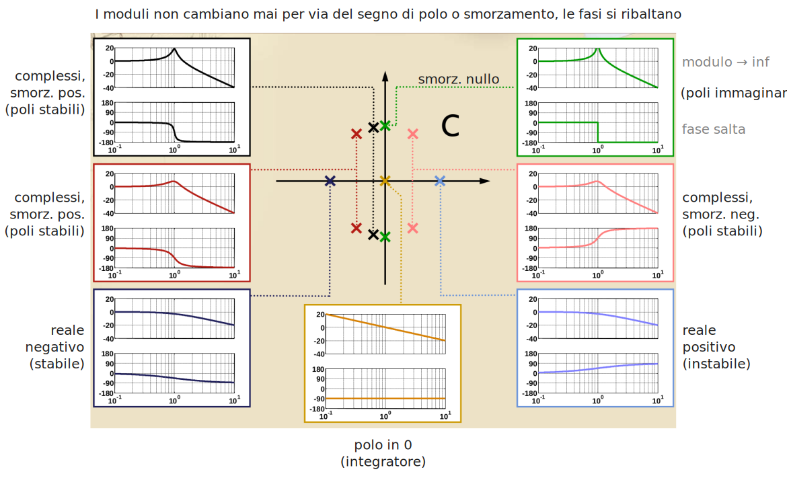
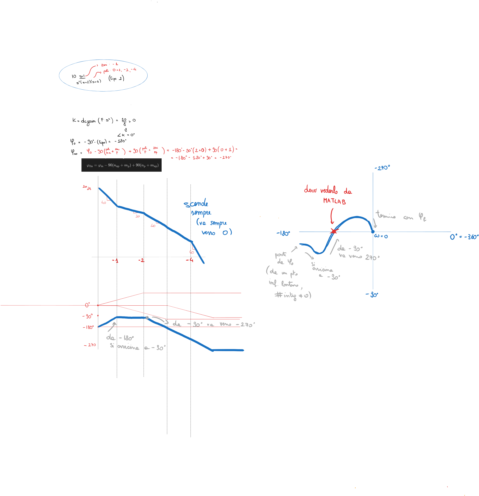

---  
share: true  
tags:  
  - controllare  
---  
I principali diagrammi che utilizzeremo per rappresentare e studiare più "agevolmente" la risposta in frequenza di un sistema sono:  
- I diagrammi di Bode  
- I diagrammi polari  
- I diagrammi di Nyquist  
- I diagrammi di Nichols  
  
## Diagrammi di Bode  
Considerando una funzione di trasferimento di un sistema nel dominio della frequenza $G(s)$ e ricordando che la variabile $s$ del dominio di Laplace è una variabile complessa, $s=j\omega$ con $\omega$ detta *pulsazione*, possiamo pensare di graficare $G(j\omega)$ in vari modi, sfruttando le varie rappresentazioni possibili di un numero complesso.  
Ad esempio, possiamo pensare di scrivere $G(s)$ nella sua rappresentazione in modulo e fase e graficare separatamente i due parametri, su due grafici diversi che abbiano come ascissa la pulsazione.  
Normalmente useremmo una scala lineare per entrambi i grafici e per entrambi gli assi di ogni grafico (*grafico naturale*). Tuttavia, tale rappresentazione non è comoda per avere un colpo d'occhio. Allora noi faremo un passaggio intermedio, effettuando la conversione del modulo da unità naturali a decibel tramite $20\log_{10}(G(s))$ e graficheremo quindi la pulsazione in scala logaritmica.   
La fase la manterremo in gradi, ma anche nel grafico della fase useremo la scala logaritmica per la sola ascissa.  
  
> [!info]  
> **Prodotto di funzioni di trasferimento (blocchi in cascata)**  
> Un altro vantaggio che traiamo nell'utilizzare la rappresentazione in modulo e fase, in particolare col modulo in decibel (notare che è una forma logaritmica) è che il prodotto di funzioni di trasferimento, ad esempio utile per calcolare la funzione di trasferimento complessiva di una serie di blocchi in cascata, diventa più semplice:  
> - il modulo di $G_1\cdot G_2$ è la somma dei moduli di $G_1$ e $G_2$  
> - la fase di $G_1\cdot G_2$ è la somma delle fasi di $G_1$ e $G_2$  
  
Così facendo avremo disegnato i **diagrammi di Bode di modulo e fase di $G(s)$**.  
  
  
  
Per costruire manualmente i diagrammi di modulo e fase, è necessario memorizzare quali siano i contributi in termini di modulo e fase di $4$ fattori fondamentali. Le funzioni di trasferimento che ci capiterà di dover graficare si potranno sempre riscrivere come composizioni di questi fattori, tramite manipolazioni algebriche. Sono scritti elevati alla ${-1}$ perchè infatti la trattazione successiva suppone di trovarsi questi fattori al denominatore della funzione di trasferimento. Se si trovano al numeratore poi vediamo cosa succede.  
  
I fattori fondamentali sono:  
1. $K$  
	1. è un fattore di tipo guadagno  
	2. il DdB del suo modulo è una retta costante di valore $20\log_{10}K$  
	3. il DdB della sua fase è una retta costante del valore $0\ K>0, -180\ K<0$  
2. $s^{-1}$  
	1. è un fattore *integratore* (è un polo in $0$ per la funzione di trasferimento)  
	2. consideriamo piuttosto il fattore $Ks^{-1}$ così da analizzarne due insieme  
	3. il DdB del suo modulo è una retta di pendenza $-20$ dB/decade e passante per i punti $(1, 20\log_{10}K)$ e $(|K|,0)$  
	4. il DdB della sua fase è una retta costante a $-90°$  
4. $\left(1-\frac{s}{\lambda}\right)^{-1}$  
	1. la funzione di trasferimento ha un polo reale in $\lambda$  
	2. per considerare i suoi contributi al diagramma di Bode della funzione, consideriamo la pulsazione normalizzata $\Omega=\omega/|\lambda|$  
	3. il DdB (con $\Omega$ per ascissa) del suo modulo è   
		1. in BassaFrequenza (AF) ($\Omega<<1 \Longleftrightarrow \omega<<|\lambda|$): costante a $0$ dB  
		2. in AltaFrequenza (BF) ($\Omega>>1 \Longleftrightarrow \omega>>|\lambda|$): retta con pendenza di $-20$ dB/decade  
		3. nel punto centrale ($\Omega=1 \Longleftrightarrow \omega=|\lambda|$): il modulo è di $-3$ dB (quindi nel punto centrale il modulo è attenuato del $50\%$)  
		4. Se si vuole tracciare un grafico "asintotico", il suo contributo è una spezzata che ha valore $0$ fino al punto centrale e scende di pendenza $-20$ dB/decade da lì in poi.  
	4. il DdB (con $\Omega$ per ascissa) della sua fase è   
		1. in BassaFrequenza (AF) ($\Omega<<1 \Longleftrightarrow \omega<<|\lambda|$): costante a $0°$  
		2. in AltaFrequenza (BF) ($\Omega>>1 \Longleftrightarrow \omega>>|\lambda|$):  costante a $-90°$ per polo stabile, $90°$ per polo instabile  
		3. nel punto centrale ($\Omega=1 \Longleftrightarrow \omega=|\lambda|$): la fase è di $-45°$ per polo stabile, $45°$ per polo instabile  
		4. Se si vuole tracciare un grafico "asintotico", il suo contributo è una spezzata che ha valore $0$ fino ad una decade prima del punto centrale, poi una retta di pendenza $\pm45°$/decade fino ad una decade dopo il punto centrale, poi ha valore $\pm90°$.  
5. $\left(1+\frac{2\zeta}{\omega_n}s+\frac{s^2}{\omega_n^2}\right)^{-1}$  
	1. la funzione di trasferimento ha due poli complessi coniugati, di pulsazione naturale $\omega_n$ e smorzamento $\zeta$ ([rivedi qui](./TAR06.Analisi%20nel%20dominio%20del%20tempo%20e%20della%20trasformata%20di%20Laplace%20di%20sistemi%20LTI%20TC.mdforma-zeri-e-poli-generalizzata-a-polinomi-aventi-radici-complesse) in caso di dubbi)  
	2. per considerare i suoi contributi al diagramma di Bode della funzione, consideriamo la pulsazione normalizzata $\Omega=\omega/\omega_n$  
	3. Ipotesi: $\zeta\ne0$  
		1. il DdB (con $\Omega$ per ascissa) del suo modulo è   
			1. in BassaFrequenza (BF) ($\Omega<<1 \Longleftrightarrow \omega<<\omega_n$): costante a $0$ dB  
			2. in AltaFrequenza (AF) ($\Omega>>1 \Longleftrightarrow \omega>>\omega_n$): retta con pendenza $-40$ dB/decade  
			3. nel punto centrale ($\Omega=1 \Longleftrightarrow \omega=\omega_n$):  il modulo è pari a $20\log_{10}\left(\frac{1}{2|\zeta|}\right)$  
			4. Se si vuole tracciare un grafico "asintotico", il suo contributo è quasi come quello del polo in $0$ ma con pendenza doppia, e potrebbe presentare un massimo (un punto di flesso a tangente verticale, un punto di non derivabilità a cuspide)(effettivamente è un picco, detto *picco di risonanza*) in corrispondenza di una specifica pulsazione $\omega_r$. Questo massimo quindi "alza" il grafico intorno a lui.  
				1. Il picco esiste se $|\zeta|<1/\sqrt{2}\approx0.707$  
				2. $\omega_r=\omega_n\sqrt{1-2\zeta^2}$  
					1. quindi $\omega_r\ne\omega_n$ e anzi la sua posizione dipende dagli specifici poli  
				3. $M_r=M(\omega_r)=\frac{1}{2|\zeta|\sqrt{1-\zeta^2}}>1$  
		2. il DdB (con $\Omega$ per ascissa) della sua fase è   
			1. in BassaFrequenza (BF) ($\Omega<<1 \Longleftrightarrow \omega<<\omega_n$): costante a $0°$  
			2. in AltaFrequenza (AF) ($\Omega>>1 \Longleftrightarrow \omega>>\omega_n$): costante a $-180°$ per polo stabile ($\zeta>0$), $180°$ per polo instabile ($\zeta<0$)  
			3. nel punto centrale ($\Omega=1 \Longleftrightarrow \omega=\omega_n$): la fase è di $-90°$ per polo stabile, $90°$ per polo instabile  
			4. Se si vuole tracciare un grafico "asintotico", il suo contributo ha un asintoto orizzontale sinistro a $0$, uno destro a $\pm180$ e intorno al punto centrale schiribissa come una $S$ al contrario in modo da avere nel punto centrale il $\pm90$. L'ampiezza dello schiribisso, così come l'ampiezza della zona vicina al punto di risonanza che si alzava, dipende dal modulo dello smorzamento.  
	4. Caso particolare: $\zeta=0$  
		1. tutto uguale, ma BF e AF ora sono praticamente separate da un unico punto, in cui il modulo va all'infinito e la fase è "indeterminata" perchè compie un salto.  
  
  
  
Considerando che moltiplicando due funzioni complesse espresse in modulo (in decibel) e fase si ottiene una funzione che ha per fase la somma delle fasi e come modulo la somma dei moduli (in decibel), si ha che se uno di questi fattori si presenta elevato a potenza $i$-esima nella funzione di trasferimento, semplicemente il suo contributo ha, nel modulo, pendenza moltiplicata per $i$, e nella fase ha pendenze e valori moltiplicati per $i$. Questo perchè è come se sommassi ogni contributo tramite un principio di sovrapposizione. In effetti, per disegnare i grafici di Bode asintotici a mano conviene proprio disegnare tutti i vari contributi indipendentemente e successivamente "sommarli graficamente".  
  
Invece, se il fattore si trova al numeratore della funzione di trasferimento e non al denominatore, *sia i contributi dei moduli che quelli delle fasi si ribaltano* (sono da moltiplicare per $-1$). In tal caso, dove prima si parlava di poli, ora si parlerà di zeri, ma il resto della trattazione resta identico.  
  
## Diagramma polare  
I diagrammi polari di funzioni complesse sono praticamente rappresentazioni grafiche sul piano di Gauss (parte reale sulle ascisse, parte immaginaria sulle ordinate). Le quantità a *modulo costante* si trovano *sulla stessa circonferenza*, quelle alla stessa fase (arctan...), *sulla stessa semiretta*.  
  
I diagrammi polari *li facciamo guardando quelli di Bode*.  
Fondamentalmente, tu del diagramma polare determini "manualmente" soltanto il *comportamento iniziale e finale* quindi per $\omega\to0^+$ e per $\omega\to+\infty$ (e anche questo, guardando Bode) e poi raccordi, sempre guardando Bode.  
In particolare:  
- **comportamento iniziale**:   
	- se il sistema *non ha poli nell'origine* allora il diagramma polare parte da un punto sull'asse reale, avente quindi fase nulla mi pare di poter dire, e modulo iniziale che posso vedere da Bode.  
	- se il sistema *ha $n$ poli nell'origine* (cioè presenta termini del tipo $K/s^n$) allora il diagramma polare parte da un punto *infinitamente lontano dall'origine*, con *fase iniziale* $$\varphi_{\text{in}}=-\frac{\pi}{2}\cdot n+\angle K$$ dove $\angle K$ è $0$ se $K>0$ oppure $\pm\pi$ se $K<0$ #controllare   
		- $K$ si determina facendo $K=\lim_{s\to0}s^nF(s)$  
		- per determinare il quadrante da cui iniziare a tracciare il diagramma dopo aver calcolato la fase iniziale devi vedere dal diagramma di Bode della fase se essa *diminuisce o aumenta* andando dal valore iniziale al valore finale e tracciare di conseguenza.  
- **comportamento finale**:   
	- **per noi, i sistemi saranno sempre strettamente propri. In questo caso, il diagramma termina sempre nell'origine**.  
	- la *fase finale* è la fase con cui arriva nell'origine ed è multipla di 90 gradi secondo $$\varphi_{\text{fin}}=\varphi_{\text{in}}-90(n_{\text{np}}+m_\text{p})+90(n_\text{p}+m_\text{np})$$ dove $n_\text{np}$ è il numero di poli a parte reale *non positiva* (esclusi quelli nell'origine), $m_\text{p}$ è il numero di zeri a parte reale positiva, ecc.  
  
  
  
## Diagramma di Nyquist  
Il diagramma di Nyquist alla fine è un diagramma polare, o meglio una loro estensione, infatti la pulsazione non è più solo positiva qui ma è $\in[-\infty, +\infty]$. Quindi che succede?  
- Devi **disegnare due volte il diagramma polare**, quando finisci di disegnarlo devi **disegnarlo ribaltato rispetto all'asse reale sullo stesso grafico** e **unire i valori che vanno all'infinito con semi-circonferenze che vanno in senso orario, di raggio infinito**.  
	- Se non hai poli nell'origine, ottieni subito un percorso chiuso.  
	- Se hai $n$ poli nell'origine, **devi fare $n$ semi-circonferenze**.  
  
>[!MATLAB]  
>Su MATLAB i diagrammi polari non ci stanno, ci sta solo il comando `nyquist(F)` e tra l'altro viene anche visualizzato con una brutta scala: meglio se zoommi sempre intorno all'origine per capire come stanno le cose. Inoltre, non ci saranno mai le circonferenze a raggio infinito.  
>Potrebbe esserti utile (ma anche no) usare `axis equal` dopo.  
  
> [!Info]  
> **Perchè va fatto così? (Lo capisce solo Gabriele sto pezzo)**  
> Il fatto che ci sia una simmetria per cui il diagramma va disegnato ribaltato deriva dal fatto che $\omega<0$ è come dire che stiamo graficando sia $G(j\omega)$ che $G(-j\omega)$.  
> Il grafico di Nyquist è una "catena chiusa" perchè in teoria sta graficando la funzione $G(s)$ da $0^+$ a $+\infty$ e da $-\infty$ a $0^-$, e i punti di $0^-$ e $0^+$ sono coincidenti, così come i punti di $+\infty$ e $-\infty$.  
  
  
  
## Diagramma di Nichols  
È un diagramma che fondamentalmente sintetizza i diagrammi di Bode in uno solo: infatti il piano di Nichols è "fase in gradi" $\times$ "modulo in dB".  
Il suo utilizzo è meglio vederlo in [IND02b.Uso dei diagrammi e margini di stabilità](./IND02b.Uso%20dei%20diagrammi%20e%20margini%20di%20stabilit%C3%A0.md).