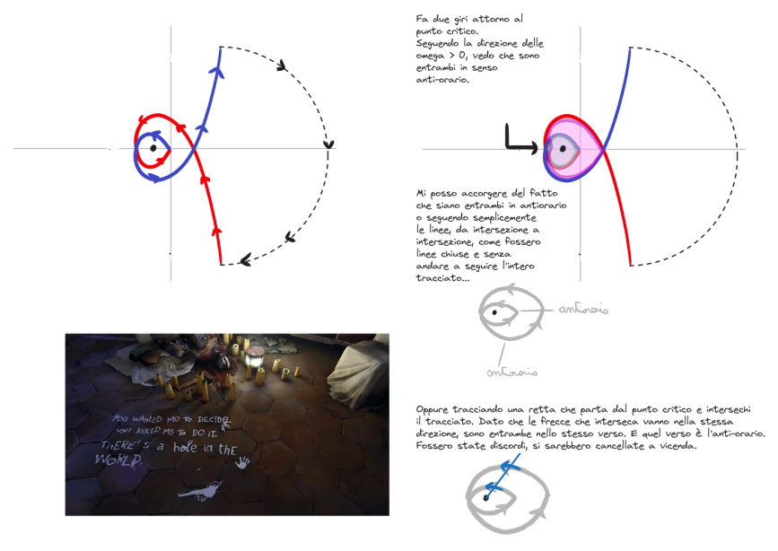
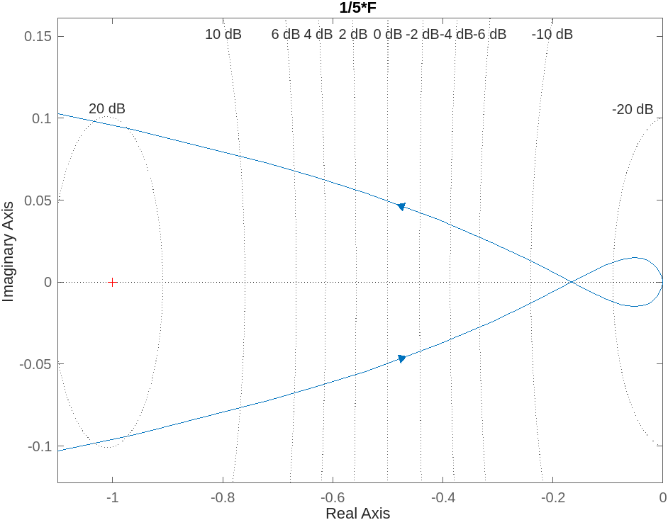
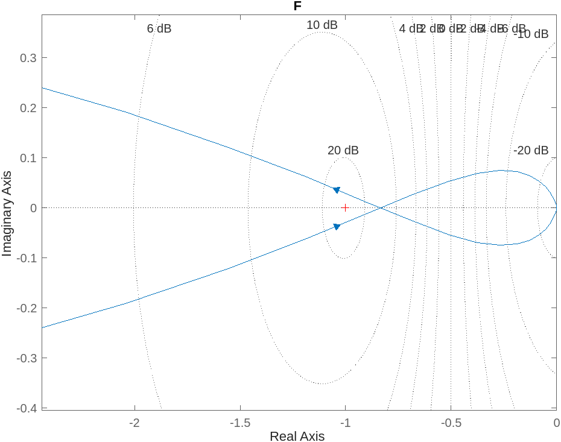
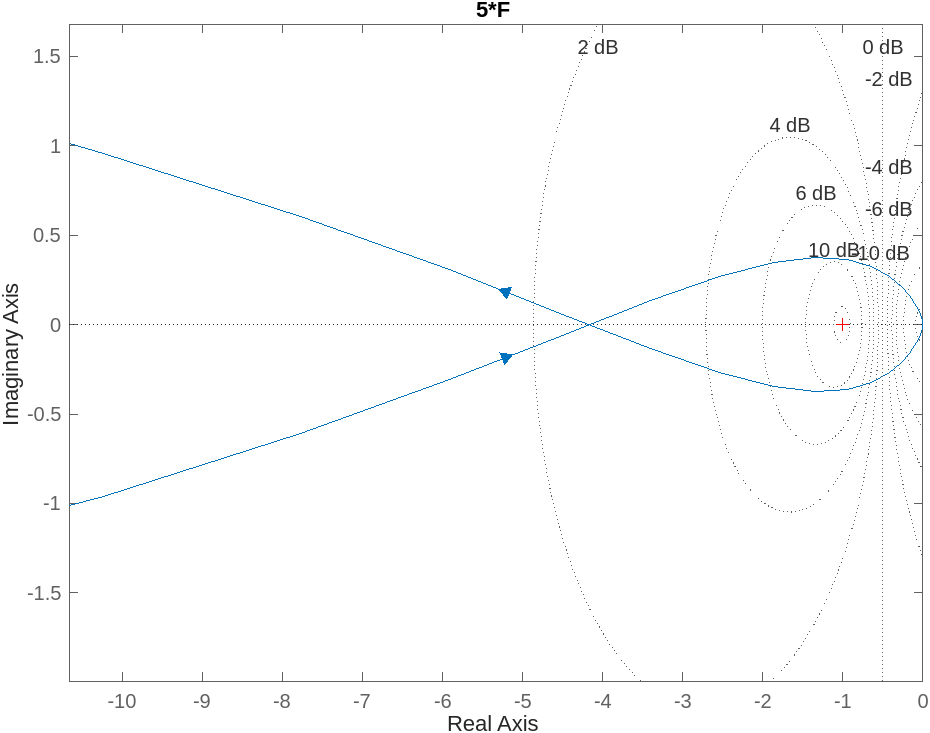
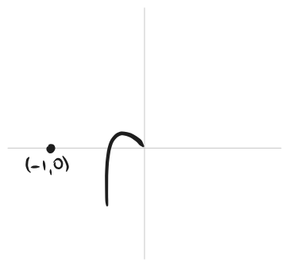

---  
share: true  
tags:  
  - TODO  
---  
## Criterio di Nyquist  
Ora come ora la struttura completa del sistema controllato è questa:  
  
  
  
Per cui la FdT è:  
- *a catena aperta / ad anello aperto*: $G_a(s)=C(s)F(s)$  
- *a catena chiusa / ad anello chiuso*: $W(s)=y(s)/r(s)=\frac{G_a(s)}{1+G_a(s)}$  
  
La **stabilità del sistema** la abbiamo fino ad ora identificata tramite il *criterio di Routh* in TC e il *criterio di Jury* in TD.   
Dato che per essere esternamente stabile un sistema deve avere tutti i suoi poli nella regione di asintotica stabilità, quindi a parte reale strettamente minore di $0$ nel caso TC oppure modulo strettamente minore di $1$ nel caso TD.   
Invece di andare a trovare i poli esplicitamente, comunque, perchè non sempre è semplice scomporre il polinomio che troviamo a denominatore della funzione di trasferimento e comunque non sempre ci serve davvero conoscere puntualmente tali radici, cercavamo di carpire solo le informazioni che ci interessavano (appunto i segni delle parti reali o i moduli di tali radici).   
Per farlo sfruttavamo questi criteri, di Routh e di Jury, che ci davano condizioni necessarie e sufficienti affinchè si verificassero quelle condizioni sulle suddette radici, senza necessità di trovarle esplicitamente.  
  
**Questo metodo non ha senso però quando siamo in fase di progetto di controllore.**  
Infatti con questo metodo possiamo, al massimo, analizzare la stabilità del sistema in sè e, in seguito alla costruzione di un certo $C(s)$, provare anche la sua stabilità in catena aperta e in catena chiusa. Il $C(s)$ lo avremo progettato imponendo che abbia alcuni parametri, che tuttavia potrebbero risultare non precisamente realizzati in un controllore costruito nella realtà (es. un parametro di un controllore per un sistema elettrico potrebbe essere una certa resistenza, ma nella vita vera una resistenza non è mai "di $10$ Ohm", ma sempre "di $10\pm5\%$ Ohm"). Il metodo che abbiamo sempre usato per analizzare la stabilità del sistema, allora, non ci darà mai informazioni sulle *tolleranze* massime che il sistema nel complesso ha rispetto a questi parametri - non abbiamo informazioni sulla *robustezza* della stabilità.   
Inoltre questo metodo, applicato alla catena aperta, non ci darà mai informazioni su come $C(s)$ andasse costruito.  
  
Invece, il **criterio di Nyquist** ci da molte più informazioni.  
In particolare, ci da due cose:  
- ci lega la stabilità del sistema in catena chiusa alla stabilità del sistema in catena aperta (!!!) - quindi ci aiuta nel progettare il controllore!  
	- progettare una $C(s)$ tale che $G_a(s)=C(s)G(s)$ sia asintoticamente stabile e abbia certe proprietà ci basta per avere la stabilità anche di $W(s)=\frac{G_a}{1+G_a}$. Rendere stabile $C(s)G(s)$ è più semplice che rendere stabile $\frac{C(s)G(s)}{1+C(s)G(s)}$: in pratica mi concentro solo sul numeratore della funzione di trasferimento in catena chiusa, ma ottengo la stabilità di tutta la funzione gratis.  
 - ci da dei *margini di stabilità*, per cui possiamo parlare della robustezza della stabilità che andiamo a conferire al sistema.  
   
**Enunciato del teorema di Nyquist**:  
- detto $n_{i,c}>0$ il numero dei poli instabili della FdT in catena chiusa $W(s)=\frac{G_a}{1+G_a}$  
- detto $n_{i,a}>0$ il numero dei poli instabili della FdT in catena aperta $G_a(s)$  
- detto il punto $(-1,0)$ *punto critico*  
- detto $N$ il numero di giri completi, *in senso orario (se in senso anti-orario, sono negativi)*, che il diagramma di Nyquist compie attorno al punto critico  
- *Il criterio è applicabile solo se il diagramma di Nyquist non passa per il punto critico*.  
Si può dimostrare $N=n_{i,c}-n_{i,a}$. Quindi, se voglio $n_{i,c}=0$, deve essere $N=-n_{i,a}$.  
  
In pratica, il numero di "giri orari netti" attorno al punto critico deve essere uguale ed opposto al numero di poli instabili nella FdT di catena aperta. Se succede questo, la FdT in catena chiusa è asintoticamente stabile.  
  
  
  
#TODO aggiusta sto disegno qua sotto... non ha senso la cosa del vedere le curve soltanto.  
  
  
  
>[!Info]  
>**Sì, ma come faccio a posizionare il punto critico correttamente sul grafico?**  
>Lo fa MATLAB. Punto. A te interessa fare *su carta* un diagramma qualitativo, per capire se su MATLAB stai zoomando abbastanza (anche se secondo me è una troiata), poi lo fai fare a MATLAB e vedi dal grafico *dove è la croce rossa*.  
>  
>In realtà controllerai su MATLAB anche tutti gli attraversamenti dell'asse reale, ovvero in che punto il diagramma di Bode ha modulo unitario.   
>In base alle coordinate di questi ci regoleremo sulla stabilità in caso di *guadagno variabile* (vedi dopo).  
  
>[!Info]  
>**Ma quindi se passa per il punto critico?**  
 È vero che se il diagramma di Nyquist passa per il punto critico allora il criterio di Nyquist non è applicabile; tuttavia, se passa per il punto critico $(-1,0)$, *il sistema ha almeno un polo sull'asse immaginario*. In queste condizioni, il sistema sicuramente non può essere asintoticamente stabile.  
  
### Guadagno variabile per la FdT a catena aperta  
Se la FdT della catena aperta ha un *guadagno variabile*, l'analisi della stabilità del sistema in catena chiusa tramite il criterio di Nyquist deve essere integrata con ulteriori considerazioni.  
$$G_a(s)=K_cG_{a,f}(s)$$  
Infatti il grafico potrebbe, variando di guadagno, crescere (nel senso di *scalarsi* come quando su Photoshop ingrandisci un'immagine prendendola dalla maniglia su uno degli angoli) e finire ad includere, o toccare, il punto critico (guadagno = raggio della circonferenza).  
Esempi:  
  
  
  
  
  
  
  
  
$K_c$ è quindi una variabile e il metodo di controllare la stabilità del sistema passerebbe per il fare tanti, tanti diagrammi di Nyquist, tra l'altro con MATLAB perchè senza di questo non siamo in grado di quotare gli attraversamenti dell'asse reale, o di regolarci sulla posizione del punto critico.   
**Per non dover disegnare duecentotrentamila diagrammi di Nyquist** piuttosto consideriamo lo stesso disegno ed immaginiamo di usare, sullo stesso grafico, *diverse scale* sulle ascisse, in modo quindi che il punto critico abbiamo posizione $\left(-\frac{1}{K_c}, 0\right)$. Lo facciamo "slittare" liberamente sulle ascisse, individuando varie *regioni* dell'asse reale.   
L'analisi della stabilità consiste quindi nell'individuare in quali di queste regioni il punto critico potrebbe trovarsi perchè il sistema sia stabile: dai vincoli sull'ascissa del "punto critico mobile" $-1/K_c$ ricaviamo vincoli su $K_c$ (rispondiamo alla domanda: in che range deve trovarsi $K_c$ perchè il sistema sia stabile? *Un'eventuale controllore "statico" che guadagno deve avere?*)  
  
> [!Warning]  
> Si può fare lo stesso discorso sia per sistemi a retroazione negativa che per sistemi a retroazione positiva.  
> Nel caso della retroazione positiva, l'unico accorgimento di cui bisogna tenere conto è che il punto critico diventa $(+1,0)$, e quindi per guadagno variabile si considerà $(1/K_c, 0)$.  
>   
## Margini di stabilità  
*Formalizziamo* il discorso de "il guadagno può stare sta $0$ e $K_{\text{critico}}$ e il sistema resta stabile" ecc.  
Sostanzialmente, definiamo i **margini di stabilità**.  
### Margine di guadagno  
Consideriamo prima delle *ipotesi semplificative* e dopo approfondiamo il resto dei casi.  
Se $G_{a}(s)$ ha le seguenti caratteristiche:  
- $\lim_{s\to0} G_a(s)>0$ (ha *guadagno stazionario positivo*)  
- non ha *singolarità* (nè zeri nè poli) a parte reale positiva (è a *minima rotazione di fase*)  
- esiste una sola pulsazione per cui il modulo di $G_a(s)$ sia $=1$ unità naturali ($=0$ dB)  
- esiste una sola pulsazione per cui la fase di $G_a(s)$ sia $=-180°$  
  
> Nsomma così:  
>   
  
Allora magari è stabile finchè il guadagno non cresce troppo  
  
  
  
e si definisce $m_G$ il modulo del reciproco dell'ascissa dell'intersezione tra il diagramma di Nyquist e l'asse reale negativo.  
Si può anche leggere *dai diagrammi di Bode* (ma in Decibel) come $-$ il modulo che la FdT a catena aperta $G_a(j\omega)$ assume in corrispondenza della particolare $\omega_{\pi}$ per cui $\angle G_a(j\omega_\pi)=-180\degree$.  
  
  
  
In definitiva,   
$$m_G=-|G_a(j\omega_\pi)|_{\text{dB}}\text{ dai diagrammi di Bode}$$  
$$m_G=\frac{1}{|x_A|}\text{ dal diagramma di Nyquist}$$  
(questo sempre **sotto le ipotesi che abbiamo fatto sopra.**)  
### Margine di fase  
**Stiamo agendo ancora sotto quelle ipotesi.**  
  
La fase la si vede dal diagramma di Nyquist come *l'angolo che si forma tra l'asse reale e la retta che passa per l'intersezione tra il grafico **del diagramma polare soltanto** e la circonferenza a modulo unitario, in senso orario, e l'origine*. La pulsazione del punto di intersezione è detta *pulsazione di crossover* $\omega_c$*.  
  
  
  
Come formula sarebbe:  
$$m_\varphi=180\degree-\angle G_a(j\omega_c)$$  
  
Dal diagramma di Bode anche si può vedere: è la fase che si ha in corrispondenza della stessa pulsazione per cui hai che il modulo di $G_a(s)=1$ *in unità naturali*, ovvero l'intersezione con l'asse delle ascisse praticamente perchè modulo $=1$ vuol dire $0$ dB.  
  
  
  
### Dai margini di stabilità alla stabilità effettiva  
**Sempre agendo sotto quelle ipotesi** se sia $m_G$ che $m_\varphi$ sono $>0$ **allora il sistema è asintoticamente stabile**.  
Per questo tipo di sistemi, praticamente si può dire se la *FdT di catena chiusa* sia stabile o meno **semplicemente guardando i diagrammi di Bode della FdT in catena *aperta***. In particolare, un sistema che sia stabile per qualunque valore positivo del guadagno non superiore alla soglia $m_G$ è detto *a stabilità regolare*.  
  
Invece, **ci sono dei casi particolari**:  
- *esistenza di più pulsazioni per cui la fase della $G_a(j\omega)$ sia $=-180\degree$* (mi da problemi nel trovare $m_G$ perchè ne avrei più di uno)  
	- nel diagramma di Nyquist ho più intersezioni con l'asse reale negativo  
	- nel diagramma di Bode della ho più intersezioni con l'asse $\varphi=-180\degree$  
	- si trovano due "candidati" per $m_G$ e si dice che il sistema in catena chiusa è da considerarsi asintoticamente stabile solo se il guadagno variabile della FdT a catena aperta è *compreso tra le due soglie*.  
	- Le due soglie si possono ancora trovare sia da Bode (esattamente come prima) sia da Nyquist (appunto fai il reciproco del modulo dell'ascissa delle due intersezioni per trovare le due soglie)   
		  
- *esistenza di più pulsazioni per cui il modulo della $G_a(j\omega)$ sia $0$ dB* (mi da problemi nel trovare $m_\varphi$ perchè ne avrei più di uno)  
	- nel diagramma di Nyquist ho più intersezioni tra il grafico **del diagramma polare** e la circonferenza a raggio unitario (o comunque raggio = modulo del punto critico)  
	- nel diagramma di Bode del modulo ho più intersezioni con l'asse $|G_a(j\omega)|=0$ dB.   
	- si trovano due o più "candidati" per $m_\varphi$ e:  
		- il margine di fase è definito come *la massima fase che si può perdere*, e continuando con questa definizione, la pulsazione di crossover sarà quella corrispondente al punto del diagramma di Nyquist, che si interseca alla circonferenza a raggio unitario, tra tutti *più vicino all'asse reale*  
			- Esempio:  
				-   
				- Il diagramma polare interseca in $3$ punti la circonferenza a raggio unitario, ma dato che $C$ è il punto più vicino all'asse reale, sul diagramma di Bode devo prendere come $\omega_c$ quella di $C$  
					-   
					- può succedere che le intersezioni che il diagramma polare ha con la circonferenza unitaria *non abbiano tutte fase $>-180\degree$*, quindi vedrai che alcuni punti di intersezione saranno nei quadranti primo e secondo del piano cartesiano.   
						-   
						- In tal caso, esisteranno **due margini di fase** - uno per la massima perdita di fase e uno per il massimo acquisto di fase. Quindi l'effettivo margine di fase è dato dall'intervallo compreso tra le due soglie.  
- $G_a(j\omega)$ *non a minima rotazione di fase - quindi avente singolarità, cioè zeri o poli, a parte reale $> 0$*: se la catena aperta è instabile allora la stabilità del sistema, se c'è, c'è solo a catena chiusa.  
	-   
>[!MATLAB]  
>`margin` ti da la lettura dei margini solo che funziona solo **sotto le ipotesi**.  
>Effettivamente ti restituisce un solo valore per ogni caso: un solo margine di guadagno, ad esempio.  
>In tal caso è probabile che ciò che ti restituisce sia il margine di attenuazione, ovvero la soglia minima del range; comunque, usare `allmargin` oppure usare `bodeplot` e graficare tutti i margini dovrebbe salvarti. Alla brutto dio, guarda i diagrammi direttamente.  
## Picchi di risonanza della funzione a catena chiusa come margini indiretti di stabilità  
È anche possibile ricavare delle informazioni sulla robustezza stabilità della catena chiusa "indirette", per esempio la presenza di un **"significativo" picco di risonanza** $M_r$ che fanno presupporre che siano, nella FdT di catena chiusa, **almeno due poli complessi coniugati con smorzamento "piccolo"**. Quanto più sono ampi i picchi di risonanza (quindi quanto più sono piccoli gli smorzamenti), tanto più il sistema è vicino alla condizione di instabilità, perchè uno smorzamento piccolo significa poli *vicini al semipiano di destra*, in particolare all'asse immaginario, e quindi poli sempre più vicini ad avere parte reale positiva invece che negativa (quindi ad essere instabili).  
  
Se la FdT a catena chiusa è $W(s)=y(s)/r(s)=K_rW_y(s)$ e chiamo $W_y(s)=y(s)/y_{\text{des}}(s)=\frac{G_a(s)}{1+G_a(s)}$, allora definisco $M_r:=\max\{|W_y(s)|\}$ (per )  
  
$$M_r=\frac{W_r}{|W_y(0)|}=\frac{1}{2\zeta\sqrt{1-\zeta^2}}\qquad\zeta\in(0,1/\sqrt{2})$$  
  
Valori tipici sono $M_r$ di qualche dB ($1\div5$) e $\zeta$ è $0.3\div 0.5$. **Valori anomali indicano poca lontananza dall'instabilità, quindi poca robustezza**.  
  
Allora succederà spesso che, nell'esercizio sul progetto del controllore, nel comunicarci la specifica sulla robustezza della stabilità del sistema controllato, non ci venga detto esplicitamente quali margini di guadagno e/o di fase il sistema debba mantenere, ma piuttosto ci venga dato un massimo assumibile dal picco di risonanza della catena chiusa (oppure altre specifiche che, tramite delle relazioni matematiche, ci riconducono ad avere vincoli sul picco di risonanza).   
Andiamo quindi ad elaborare un criterio che ci dica, a partire dai diagrammi (in particolare di Nyquist e di Nichols) della funzione d'anello (= catena aperta) se la funzione di catena chiusa toccherà mai certi valori.  
### Cerchi M  
Andiamo a definire quali siano, sul piano complesso (e quindi nel diagramma di Nyquist, che si disegna appunto nel piano complesso) i *luoghi a modulo costante*.  
La variazione del modulo della funzione di catena chiusa (qui a meno del fattore di scala) $W_y(s)$ è graficabile tramite la funzione complessa $$M(s=j\omega)=\left|\frac{G_a(j\omega)}{1+G_a(j\omega)}\right|$$  
che si può anche scrivere, essendo $G_a(j\omega)$ una funzione complessa, come   
$$M(j\omega)=\left|\frac{\Re+j\Im}{1+\Re+j\Im}\right|\implies M^2(j\omega)=\left|\frac{\Re+j\Im}{1+\Re+j\Im}\right|^2$$  
Per trovare i luoghi a modulo costante pari ad $M_0$, eguagliamo l'espressione ad $M^2_0$ e tramite alcuni (chiavici) passaggi matematici arriviamo a scrivere l'espressione   
$$(\Re-\Re_0)^2+\Im^2=\rho^2$$  
con $\Re_0=\frac{M_0^2}{1-M_0^2}$ e $\rho=\frac{M_0}{|1-M_0^2|}$.  
Il risultato, quindi, è che *i luoghi a modulo costante $M_0$, nel piano complesso, sono circonferenze di raggio e centro diversi e dipendenti da $M_0$, ma tutte con centro sull'asse reale, e simmetriche per l'asse immaginario*. Queste circonferenze sono dette *cerchi M*.  
  
  
  
Il criterio che ci assicura che la funzione in catena chiusa non avrà un picco di risonanza superiore a $M_0$ ci dice che *il diagramma di Nyquist della funzione di catena aperta deve essere esterno al cerchio M corrispondente ad $M_0$ per tutti i valore di $\omega$*.  
  
  
  
  
  
  
  
>[!iInfo]  
>**Luoghi a fase costante**  
>Si potrebbero definire anche dei *cerchi N*, corrispondenti ai luoghi a fase costante, ma non sono di interesse pratico per il nostro corso. Comunque sì, anche in quel caso sono circonferenze. Hanno centro in $\left(-\frac{1}{2}, \frac{1}{2N}\right)$ e raggio $\frac{1}{2}\sqrt{\frac{N^2+1}{N^2}}$.  
  
> [!Warning]  
>  **Relazioni tra specifiche**  
> A volte non ci viene data neppure una specifica esplicita sul valore del picco di risonanza, ma invece ci vengono date altre specifiche (sulla catena chiusa o sulla catena aperta, sulla risposta nel dominio del tempo o sulla risposta nel dominio della frequenza) che sono correlate ad esso e quindi da cui possiamo estrapolarne, tramite relazioni matematiche, la specifica sul picco di risonanza e quindi sul minimo margine di fase da garantire in catena aperta perchè la catena chiusa sia asintoticamente stabile e con la robustezza voluta.  
>   
> Queste relazioni matematiche le enunciamo tenendo conto che i sistemi che vedremo in questo corso, quando non di secondo ordine, avranno comunque un *comportamento dominante di secondo ordine* e quindi saranno approssimabili come sistemi di secondo ordine. Questo ci permetterà di garantire la validità generale, *sebbene con una certa approssimazione*, di relazioni matematiche semplici.  
>   
> Maggiori informazioni: [IND03.Analisi approfondita delle specifiche di progetto](./IND03.Analisi%20approfondita%20delle%20specifiche%20di%20progetto.md)  
>   
>   
>   
>   
>   
  
## Diagramma di Nichols  
Il diagramma di Nichols è l'ennesimo modo di graficare una funzione di trasferimento. In particolare, si tratta di un diagramma che unisce i due diagrammi di Bode in uno solo, infatti ha come ascisse la fase espressa in gradi e come ordinate il modulo, espresso in dB.  
Il risultato è un grafico i cui due assi principali sono l'asse a $0$ dB e l'asse a $-180°$, sul quale è estremamente facile leggere i margini di stabilità nel caso di stabilità regolare: infatti all'intersezione tra questi due assi troviamo il punto a coordinate $(-180, 0)$ che altro non è se non il *punto critico di Nyquist*, e i margini di stabilità sono definiti come la distanza del grafico della funzione di catena aperta rispetto a questo.  
La distanza sulle ascisse sarà il margine di fase e la distanza sulle ordinate sarà il margine di guadagno.  
  
  
  
  
  
Inoltre anche sul diagramma di Nichols è possibile identificare i cerchi M e quindi leggere, anche da questo grafico, il valore di modulo e fase di $G_a(j\omega)$ per ogni $\omega$. L'insieme dei cerchi M (in blu) e dei cerchi N (in rosso) tracciati sul diagramma di Nichols prende il nome di *carta di Nichols*.  
  
  
  
Sovrapponendoci il diagramma di Nichols della funzione in oggetto, quindi, possiamo applicare lo stesso criterio di cui parlavamo con il diagramma di Nyquist per il picco di risonanza. *Se il diagramma di Nichols della funzione non interseca mai il cerchio M corrispondente a $M_0$, allora la funzione in catena chiusa avrà picco di risonanza strettamente minore di $M_0$, quindi modulo ovunque minore di $M_0$*.  
  
  
  
Ma il diagramma di Nichols ci offre, a questo punto, un modo facile di correlare i margini di guadagno e fase con la specifica sul picco di risonanza. Infatti la richiesta che il grafico della funzione di catena aperta non tocchi mai il cerchio M corrispondente ad un certo valore del picco di risonanza *ci impone vincoli sulle coordinate dei punti di intersezione dello stesso grafico con gli assi principali del diagramma di Nichols, quindi con i margini di stabilità*.  
In particolare, noteremo che (almeno per le funzioni di trasferimento trattate nel nostro corso) il margine di guadagno *raramente influisce sulla specifica di robustezza tramite vincolo sul picco di risonanza e, in verità, sulla asintotica stabliità del sistema in catena chiusa in generale*, in quanto si vede bene dal diagramma di Nichols che è un vincolo abbastanza facile da rispettare.  
Diverso invece per il *margine di fase*, che spesso diventa il vincolo principale.  
  
  
  
Fondamentalmente, quando si tratterà di dover garantire una specifica sul picco di risonanza, dal diagramma di Nichols sovrapposto alla carta di Nichols della funzione in catena chiusa capiremo di quanto sarà necessario *spostare il grafico della funzione d'anello (catena aperta) verso destra e verso l'alto o il basso, dove spostare a destra vuol dire garantire un certo margine di fase tramite il controllore, mentre spostare in alto o in basso vuol dire inserire un fattore di guadagno statico nel controllore*.  
  
>[!Warning]  
>Quando con le relazioni matematiche semplici che utilizziamo andiamo a calcolare il margine di fase da garantire partendo da altre specifiche, ad esempio tramite $m_\varphi M_r\approx60$, va sempre tenuto in considerazione che *stiamo usando equazioni approssimate* ed è possibile che esca un valore di $m_\varphi$ minore del minimo valore del margine di fase che si trova dal diagramma di Nichols della funzione di catena aperta sovrapposto alla carta di Nichols. **In ogni caso, il minimo margine di fase da garantire è quello che si trova da Nichols**.  
  
