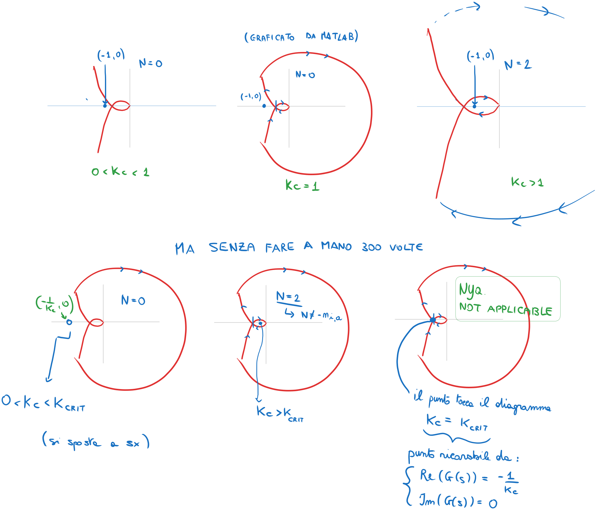
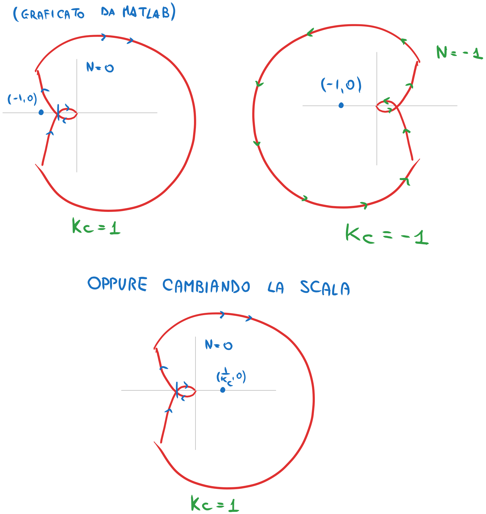

---  
share: true  
tags:  
  - continuare  
---  
## Criterio di Nyquist  
Ora come ora la struttura completa del sistema controllato è questa:  
  
  
  
Per cui la FdT è:  
- *a catena aperta / ad anello aperto*: $G_a(s)=C(s)F(s)$  
- *a catena chiusa / ad anello chiuso*: $W(s)=y(s)/r(s)=\frac{G_a(s)}{1+G_a(s)}$  
  
La **stabilità del sistema** la abbiamo fino ad ora identificata tramite il *criterio di Routh* in TC e il *criterio di Jury* in TD.   
Dato che per essere esternamente stabile un sistema deve avere tutti i suoi poli nella regione di asintotica stabilità, quindi a parte reale strettamente minore di $0$ nel caso TC oppure modulo strettamente minore di $1$ nel caso TD.   
Invece di andare a trovare i poli esplicitamente, comunque, perchè non sempre è semplice scomporre il polinomio che troviamo a denominatore della funzione di trasferimento e comunque non sempre ci serve davvero conoscere puntualmente tali radici, cercavamo di carpire solo le informazioni che ci interessavano (appunto i segni delle parti reali o i moduli di tali radici).   
Per farlo sfruttavamo questi criteri, di Routh e di Jury, che ci davano condizioni necessarie e sufficienti affinchè si verificassero quelle condizioni sulle suddette radici, senza necessità di trovarle esplicitamente.  
  
**Questo metodo non ha senso però quando siamo in fase di progetto di controllore.**  
Infatti con questo metodo possiamo, al massimo, analizzare la stabilità del sistema in sè e, in seguito alla costruzione di un certo $C(s)$, provare anche la sua stabilità in catena aperta e in catena chiusa. Il $C(s)$ lo avremo progettato imponendo che abbia alcuni parametri, che tuttavia potrebbero risultare non precisamente realizzati in un controllore costruito nella realtà (es. un parametro di un controllore per un sistema elettrico potrebbe essere una certa resistenza, ma nella vita vera una resistenza non è mai "di $10$ Ohm", ma sempre "di $10\pm5\%$ Ohm"). Il metodo che abbiamo sempre usato per analizzare la stabilità del sistema, allora, non ci darà mai informazioni sulle *tolleranze* massime che il sistema nel complesso ha rispetto a questi parametri - non abbiamo informazioni sulla *robustezza* della stabilità.   
Inoltre questo metodo, applicato alla catena aperta, non ci darà mai informazioni su come $C(s)$ andasse costruito.  
  
Invece, il **criterio di Nyquist** ci da molte più informazioni.  
In particolare, ci da due cose:  
- ci lega la stabilità del sistema in catena chiusa alla stabilità del sistema in catena aperta (!!!) - quindi ci aiuta nel progettare il controllore!  
	- progettare una $C(s)$ tale che $G_a(s)=C(s)G(s)$ sia asintoticamente stabile e abbia certe proprietà ci basta per avere la stabilità anche di $W(s)=\frac{G_a}{1+G_a}$. Rendere stabile $C(s)G(s)$ è più semplice che rendere stabile $\frac{C(s)G(s)}{1+C(s)G(s)}$: in pratica mi concentro solo sul numeratore della funzione di trasferimento in catena chiusa, ma ottengo la stabilità di tutta la funzione gratis.  
 - ci da dei *margini di stabilità*, per cui possiamo parlare della robustezza della stabilità che andiamo a conferire al sistema.  
   
**Enunciato del teorema di Nyquist**:  
- detto $n_{i,c}>0$ il numero dei poli instabili della FdT in catena chiusa $W(s)=\frac{G_a}{1+G_a}$  
- detto $n_{i,a}>0$ il numero dei poli instabili della FdT in catena aperta $G_a(s)$  
- detto il punto $(-1,0)$ *punto critico*  
- detto $N$ il numero di giri completi, *in senso orario (se in senso anti-orario, sono negativi)*, che il diagramma di Nyquist compie attorno al punto critico  
- *Il criterio è applicabile solo se il diagramma di Nyquist non passa per il punto critico*.  
Si può dimostrare $N=n_{i,c}-n_{i,a}$. Quindi, se voglio $n_{i,c}=0$, deve essere $N=-n_{i,a}$.  
  
In pratica, il numero di "giri orari netti" attorno al punto critico deve essere uguale ed opposto al numero di poli instabili nella FdT di catena aperta. Se succede questo, la FdT in catena chiusa è asintoticamente stabile.  
  
  
  
  
  
>[!Info]  
>**Sì, ma come faccio a posizionare il punto critico correttamente sul grafico?**  
>Lo fa MATLAB. Punto. A te interessa fare *su carta* un diagramma qualitativo, per capire se su MATLAB stai zoomando abbastanza (anche se secondo me è una troiata), poi lo fai fare a MATLAB e vedi dal grafico dove è la croce rossa.  
>  
>In realtà ti converrebbe vedere in che punto hai che il diagramma di Nyquist ha un attraversamento dell'asse reale, ovvero in che punto il diagramma di Bode ha modulo unitario, con fase di $-180°$. In base alle coordinate di questo allora ti regoli su dove si va a posizionare il punto critico.  
  
>[!Info]  
>**Ma quindi se passa per il punto critico?**  
 È vero che se il diagramma di Nyquist passa per il punto critico allora il criterio di Nyquist non è applicabile; tuttavia, se passa per il punto critico $(-1,0)$, *il sistema ha almeno un polo sull'asse immaginario*. In queste condizioni, il sistema sicuramente non può essere asintoticamente stabile.  
  
### Guadagno variabile per la FdT a catena aperta  
Se la FdT della catena aperta ha un guadagno variabile rischia di portare la catena chiusa ad essere instabile quando questo guadagno cresce troppo.   
$$G_a(s)=K_cG_{a,f}(s)$$  
Infatti il grafico potrebbe, variando di guadagno, crescere (nel senso di *scalarsi* come quando su Photoshop ingrandisci un'immagine prendendola dalla maniglia su uno degli angoli) e finire ad includere, o toccare, il punto critico (guadagno = raggio della circonferenza, remember).  
Esempi:  
  
  
  
  
  
  
  
  
  
$K_c$ è una variabile. **Per non dover disegnare duecentotrentamila diagrammi di Nyquist** piuttosto disegnamo *diverse scale* sulle ascisse, in modo quindi che il punto critico abbiamo posizione $\left(-\frac{1}{K_c}, 0\right)$ e si muova liberamente sulle ascisse.  
#### Sistemi con retroazione negativa  
  
  
  
  
  
#### Sistemi con retroazione positiva  
**TUTTO RIBALTATO**. Cioè il punto critico nel caso di retroazione positiva con guadagno unitario è $(+1,0)$. Il resto della trattazione resta uguale.  
## Margini di stabilità  
Formalizziamo la cosa di dire che "il guadagno può stare sta $0$ e $K_{\text{critico}}$ e il sistema resta stabile" ecc.  
Sostanzialmente, definiamo i **margini di stabilità**.  
### Margine di guadagno  
Sia $Ga(j\omega) = Kc G_{a,f}(j\omega)$, $G_{a,f}(j\omega)$ a guadagno stazionario positivo (nel senso se fai limite per $s\to0$ ecc), priva di poli a parte reale positiva (ovvero è **a minima rotazione di fase**), e sia il suo diagramma polare tale da attraversare una sola volta il semiasse reale negativo in un punto alla destra del punto critico.  
  
> Nsomma così:  
>   
  
Allora magari è stabile finchè il guadagno non cresce troppo  
  
  
  
e si definisce $m_G$ il modulo del reciproco dell'ascissa dell'intersezione tra il diagramma di Nyquist e l'asse reale negativo.  
Si può anche leggere *dai diagrammi di Bode* (ma in Decibel) come $-$ il modulo che la FdT a catena aperta $G_a(j\omega)$ assume in corrispondenza della particolare $\omega_{\pi}$ per cui $\angle G_a(j\omega_\pi)=-180\degree$.  
  
  
  
In definitiva,   
$$m_G=-|G_a(j\omega_\pi)|_{\text{dB}}\text{ dai diagrammi di Bode}$$  
$$m_G=\frac{1}{|x_A|}\text{ dal diagramma di Nyquist}$$  
(questo sempre **sotto le ipotesi che abbiamo fatto sopra.**)  
### Margine di fase  
**Stiamo agendo ancora sotto quelle ipotesi.**  
  
La fase la si vede dal diagramma di Nyquist come *l'angolo che si forma tra l'asse reale e la retta che passa per l'intersezione tra il grafico **del diagramma polare soltanto** e la circonferenza a modulo unitario, in senso orario*. La pulsazione del punto di intersezione è detta *pulsazione di crossover* $\omega_c$*.  
  
  
  
Come formula sarebbe:  
$$m_\varphi=180\degree-\angle G_a(j\omega_c)$$  
  
Dal diagramma di Bode anche si può vedere: è la fase che si ha in corrispondenza della stessa pulsazione per cui hai che il modulo di $G_a(s)=1$ *in unità naturali*, ovvero l'intersezione con l'asse delle ascisse praticamente perchè modulo $=1$ vuol dire $0$ dB.  
  
  
### Dai margini di stabilità alla stabilità effettiva  
**Sempre agendo sotto quelle ipotesi** se sia $m_G$ che $m_\varphi$ sono $>0$ **allora il sistema è asintoticamente stabile**.  
Per questo tipo di sistemi, praticamente si può dire se la FdT di catena chiusa sia stabile o meno **semplicemente guardando i diagrammi di Bode della FdT in catena aperta**. In particolare, un sistema che sia stabile per qualunque valore positivo del guadagno non superiore alla soglia $m_G$ è detto *a stabilità regolare*.  
  
Invece, **ci sono dei casi particolari**:  
- *esistenza di più pulsazioni per cui la fase della $G_a(j\omega)$ sia $=-180\degree$* (mi da problemi nel trovare $m_G$ perchè ne avrei più di uno)  
	- nel diagramma di Nyquist ho più intersezioni con l'asse reale negativo  
	- nel diagramma di Bode della ho più intersezioni con l'asse $\varphi=-180\degree$  
	- si trovano due "candidati" per $m_G$ e si dice che il sistema in catena chiusa è da considerarsi asintoticamente stabile solo se il guadagno variabile della FdT a catena aperta è *compreso tra le due soglie*.  
	- Le due soglie si possono ancora trovare sia da Bode (esattamente come prima) sia da Nyquist (appunto fai il reciproco del modulo dell'ascissa delle due intersezioni per trovare le due soglie)   
		  
- *esistenza di più pulsazioni per cui il modulo della $G_a(j\omega)$ sia $0$ dB* (mi da problemi nel trovare $m_\varphi$ perchè ne avrei più di uno)  
	- nel diagramma di Nyquist ho più intersezioni tra il grafico **del diagramma polare** e la circonferenza a raggio unitario (o comunque raggio = modulo del punto critico)  
	- nel diagramma di Bode del modulo ho più intersezioni con l'asse $|G_a(j\omega)|=0$ dB.   
	- si trovano due o più "candidati" per $m_\varphi$ e:  
		- il margine di fase è definito come *la massima fase che si può perdere*, e continuando con questa definizione, la pulsazione di crossover sarà quella corrispondente al punto del diagramma di Nyquist, che si interseca alla circonferenza a raggio unitario, tra tutti *più vicino all'asse reale*  
			  > Esempio:  
			  >   
			  > Il diagramma polare interseca in $3$ punti la circonferenza a raggio unitario, ma dato che $C$ è il punto più vicino all'asse reale, sul diagramma di Bode devo prendere come $\omega_c$ quella di $C$  
			  >   
			    
		- può succedere che le intersezioni che il diagramma polare ha con la circonferenza unitaria *non abbiano tutte fase $>-180\degree$*, quindi vedrai che alcuni punti di intersezione saranno nei quadranti primo e secondo del piano cartesiano.   
		    
		  In tal caso, esisteranno **due margini di fase** - uno per la massima perdita di fase e uno per il massimo acquisto di fase. Quindi l'effettivo margine di fase è dato dall'intervallo compreso tra le due soglie.  
- $G_a(j\omega)$ *non a minima rotazione di fase - quindi poli a parte reale $> 0$ - quindi instabile* (il problema è che se la catena aperta è instabile allora bisogna vedere cosa succede a catena chiusa per definire se il sistema in catena chiusa sia stabile o meno).  
	-   
#### Con MATLAB  
`margin` ti da la lettura dei margini solo che funziona solo **con le ipotesi**. Altrimenti fai a mano.  
### Picchi di risonanza della funzione a catena chiusa come margini indiretti di stabilità  
È anche possibile ricavare delle informazioni sulla robustezza stabilità della catena chiusa "indirette", per esempio la presenza di un **"significativo" picco di risonanza** $M_r$ che fanno presupporre che siano, nella FdT di catena chiusa, **almeno due poli complessi coniugati con smorzamento "piccolo"**. Quanto più sono ampi i picchi di risonanza (quindi quanto più sono piccoli gli smorzamenti), tanto più il sistema è vicino alla condizione di instabilità, perchè uno smorzamento piccolo significa poli vicini al semipiano di destra, e quindi poli sempre più vicini ad avere parte reale positiva invece che negativa.  
  
Se la FdT a catena chiusa è $W(s)=y(s)/r(s)=K_rW_y(s)$ e chiamo $W_y(s)=y(s)/y_{\text{des}}(s)=\frac{G_a(s)}{1+G_a(s)}$, allora chiamo $W_r=\max\{|W_y(s)|\}$  
  
$$M_r=\frac{W_r}{|W_y(0)|}=\frac{1}{2\zeta\sqrt{1-\zeta^2}}\qquad\zeta\in(0,1/\sqrt{2})$$  
  
quindi, per esempio, valori tipici sono $M_r$ di qualche dB ($1\div5$) e $\zeta$ è $0.3\div 0.5$. **Valori anomali indicano poca lontananza dall'instabilità, quindi poca robustezza**.  
#### Legame tra picchi di risonanza della FdT di catena chiusa e diagramma di Nyquist della FdT di catena aperta   
**Non ho capito un cazzo del resto**, ma la parte importante sembra essere che **se costruisci le circonferenze descritte dalle equazioni** $$(\mathcal{R}-\mathcal{R}_0)^2+\mathcal{I}^2=\rho^2$$ ovvero circonferenze nel piano complesso di raggio $\rho$ e centro $(\mathcal{R}_0, 0)$, dove $$\mathcal{R}_0=\frac{M^2}{1-M^2},\ \rho=\frac{M}{|1-M^2|}$$  
dove   
$$M(j\omega)=|W_y(j\omega)|=\left|\frac{G_a(j\omega)}{1+G_a(j\omega)}\right|$$  
  
avrò, **al variare di $M$, una serie di circonferenze concentriche (cerchi M)**.  
  
  
  
#continuare   
  
