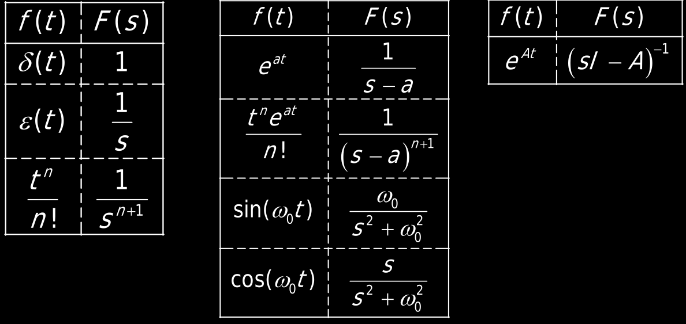

---  
share: true  
---  
## Soluzione nel dominio del tempo  
Il comportamento dinamico di un sistema LTI TC a dimensione finita è descritto dalle equazioni di ingresso-stato-uscita   
$$\dot{x}(t) = Ax(t)+Bu(t)$$  
$$y(t) = Cx(t)+Du(t)$$  
dove:  
- $x$ è il vettore colonna delle variabili di stato e ha $n$ righe  
- $u$ è il vettore colonna degli ingressi e ha $p$ righe  
- $y$ è il vettore colonna delle variabili di interesse e ha $q$ righe  
di conseguenza:  
- $A$ è una matrice quadrata $n\times n$  
- $B$ è una matrice rettangolare $n\times p$  
- $C$ è una matrice rettangolare $q\times n$  
- $D$ è una matrice rettangolare $q\times p$  
A partire da uno stato iniziale $x(t=0_-)$ noto e conoscendo le matrici $A$ e $B$, e $u(t)$ si dovrà quindi, per conoscere l'evoluzione del sistema nel tempo, risolvere la prima equazione differenziale in modo da trovare $x(t)$ (il *movimento* dello stato). Una volta trovato quello dalla prima equazione (che serve solo a quello) si può sostituire nell'equazione delle uscite e ottenere un'associazione input-output.  
L'espressione di $x(t)$ si calcola con la **formula di Lagrange** (che è un casino inutile da scrivere e non si usa negli esercizi) - l'importante è che la soluzione dipende da due parti:  
  
- il primo contributo dipende solo dallo stato iniziale $x(0_-)$, ovvero dall'equazione omogenea associata all'equazione differenziale   
	- $$\dot{x}(t)=Ax(t)$$  
- Questo contributo è detto *movimento libero* dello stato.  
- il secondo contributo (*movimento forzato* dello stato) è invece un prodotto di convoluzione che dipende dall'ingresso e non dallo stato iniziale.  
L'andamento di $y(t)$, detto *movimento dell'uscita*, si ottiene dalla sua relazione statica sostituendo per $x(t)$ l'espressione data dalla formula di Lagrange. Anche l'uscita, quindi, è la somma di una *risposta libera* e di una *risposta forzata*.  
Il problema principale di questo calcolo è la matrice esponenziale $e^{At}$, che è una matrice con le stesse dimensioni della matrice $A$, ma è una *matrice di funzioni nel tempo* che non abbiamo davvero voglia di fare, perciò cercheremo vie alternative. E poi c'è un bruttissimo prodotto di convoluzione a destra.  
## Soluzione nel dominio di Laplace  
Questo lo facciamo negli esercizi. La trasformata che usiamo per questo corso è la *trasformata unilatera di Laplace*, ovvero:  
$$F(s)=\mathcal{L}\{f(t)\}=\int_{0_-}^{+\infty}{f(t)e^{-st}dt}$$  
(si usa $0_-$ per evitare problemi di definizione dell'integrale nel caso di funzioni discontinue in $0$). Le proprietà sono le solite:  
- linearità (trasformata di combinazione lineare = combinazione lineare di trasformate)  
- $\mathcal{L}\{\dot{f}(t)\}=sF(s)-f(0_-)$   
- $\mathcal{L}\{\ddot{f}(t)\}=s^2F(s)-sf(0_-)-\dot{f}(0_-)$   
- $\mathcal{L}\{\int_{0_-}^t{f}(\tau)d\tau\}=\frac{F(s)}{s}$ (sembra quasi il reciproco della trasormata della derivata, ma nessuna dipendenza da $f(0_-)$)  
- $\mathcal{L}\{f(t-\tau)\}=F(s)e^{-\tau s},\ e^{-s\tau}\in\mathbb{C}$  
- $\mathcal{L}\{f_1(t)* f_2(t)\}=F_1(s)F_2(s)$  
- tabella delle trasformate utili:	  
	-   
Esempio:   
	segnale a rampa unitaria: integrale nel tempo del segnale $\epsilon(t)$. La sua trasformata di Laplace è quindi $\frac{1}{s}$ per la trasformata del gradino. (quindi $\frac{1}{s^2}$).  
  
Tutti i segnali che analizziamo sono *unilateri* (diversi da $0$ da $t=0_-$ in poi). Quindi conviene dire che *tutti i segnali sono moltiplicati per il gradino $\epsilon(t)$*.  
  
$\frac{t^n}{n!}$ è il cosiddetto *segnale polinomiale*.   
  
In $e^{at}$, $a$ può essere $\in \mathbb{C}$.  
  
*La trasformata della matrice esponenziale* è una matrice quadrata di espressione $(sI_n-A)^{-1}$, con $I_n$ la matrice identità di dimensioni $n\times n$.  
### Soluzione nel dominio della frequenza  
- Si applica la trasformata di Laplace alle equazioni dello stato nel dominio del tempo   
	- $$\mathcal{L}[\dot{x}(t)]=\mathcal{L}[Ax(t)+Bu(t)]$$  
- Lavorandoci si ottengono la trasformata di Laplace dei movimenti dello stato e di uscita (porto a primo membro tutti i termini che dipendono da $X(s)$, ricordando che il prodotto matriciale non è commutativo - se trovi una somma tra scalare e matrice, moltiplica per $I_n$ lo scalare). Poi puoi dividere per una matrice (ovvero moltiplicare per l'inversa, *se esiste*).  
	- L'inversa esiste se il determinante $\ne 0$  
	- Il determinante di $(sI_n-A)$ è un polinomio in $s$ di grado $n$ a coefficienti reali   
	- Il polinomio è non nullo in tutti i punti tranne che in $n$ radici, dette *autovalori*; l'inversa quindi esiste (e di conse guenza la soluzione esiste) per tutti i valori di $s$ tranne che per gli autovalori.  
- Si nota il legame tra la formula di Lagrange e l'espressione di $X(s)$ trovata. Ai due contributi sono semplicemente sostituite le loro trasformate di Laplace.  
- Si ottengono allora i movimenti nel dominio del tempo applicando una anti-trasformata alle equazioni trovate.  
$$\dot{x}(t)=Ax(t)+Bu(t)=\frac{dx(t)}{dt}$$  
$$\mathcal{L}\{\dot{x}(t)\}(s)=\mathcal{L}\{Ax(t)+Bu(t)\}=\mathcal{L}\left\{\frac{dx(t)}{dt}\right\}$$  
Dalle proprietà di linearità e di derivazione nel tempo della TdL:  
$$AX(s)+BU(s)=sX(s)-x(0^-)$$  
$$BU(s)+x(0^-)=sX(s)-AX(s)$$  
$$BU(s)+x(0^-)=(sI-A)X(s)$$  
$$(sI-A)^{-1}BU(s)+(sI-A)^{-1}x(0^-)=$$  
$$=(sI-A)^{-1}(sI-A)X(s)$$  
Da cui  
$$X(s)=(sI-A)^{-1}x(0^-)+(sI-A)^{-1}BU(s)=$$  
$$=X_l(s)+X_f(s)$$  
Facendo la trasformata di Laplace di ambo i membri dell'equazione dell'uscita $y$ e sostituendoci la $X(s)$ trovata dal procedimento precedente si trova:  
$$y(t)=Cx(t)+Du(t)$$  
$$Y(s)=CX(s)+DU(s)$$  
$$Y(s)=C[(sI_n-A)^{-1}x_{0_-}+(sI_n-A)^{-1}BU(s)]+DU(s)$$  
$$Y(s)=C(sI_n-A)^{-1}x_{0_-}+[C(sI_n-A)^{-1}B+D]U(s)$$  
$$Y(s)=C[(sI_n-A)^{-1}x_{0_-}+(sI_n-A)^{-1}BU(s)]+DU(s)$$  
$$Y(s)=H_0x_{0_-}+H(s)U(s)$$  
Con $H(s)$ che è la matrice di trasferimento del sistema. Questa funzione può, da sola, rappresentare l'intero sistema, a patto che si parta da $x_{0_-}=0$, ovvero che nell'istante iniziale il sistema si possa considerare "a riposo".  
Questa funzione è, in generale, una matrice complessa rettangolare $p\times q$, i cui elementi sono rapporti di polinomi (= *funzioni razionali fratte*) nella variabile complessa $s$.  
  
  
  
Dunque ogni elemento della matrice di trasferimento è *un peso*, il peso con cui un certo ingresso influenza una certa uscita.   
Dalla sommatoria si vede come una funzione di trasferimento possa essere il rapporto tra l'uscita (una particolare uscita) e un particolare ingresso solo a patto che tutti gli altri ingressi siano spenti (=> nei sistemi dinamici LTI TC vale quindi il *principio di sovrapposizione*).  
### Rappresentazioni della matrice di trasferimento  
#### Forma polinomiale  
La *funzione* di trasferimento è la matrice $H(s)$ nel sistema SISO, ovvero con un solo ingresso e una sola uscita. La funzione di trasferimento è quindi una funzione razionale fratta e si può scrivere come rapporto tra un polinomio numeratore $N_H(s)$ e un polinomio denominatore $D_H(s)$ uguale al determinante della matrice $(sI_n-A)$.  
$$H(s)=\frac{N_H(s)}{D_H(s)}=\frac{b_ms^m+b_{m-1}s^{m-1}+\text{...}+b_1s+b_0}{a_ns^n+a_{n-1}s^{n-1}+\text{...}+a_1s+a_0},\ m\le n$$  
Il fatto che il grado del numeratore non possa essere maggiore del grado del denominatore deriva dalla forma stessa di $H(s)$ come l'abbiamo definita sopra.  
A seconda del grado dei polinomi, inoltre, si distinguono:  
- funzione di trasferimento *strettamente propria* se $m<n$ => in tal caso $b_m=D=0$ => il sistema è proprio ovvero non c'è una ripercussione istantanea dell'ingresso sull'uscita ma l'uscita dipende solo dalle variabili di stato  
- funzione di trasferimento *non strettamente propria* o più precisamente *bipropria* se $m = n$; in tal caso il sistema è *improprio* e si ha $b_m=D\neq0$.  
#### Forma zeri e poli  
In questa forma si vanno ad evidenziare le radici di numeratore (*zeri*) e denominatore (*poli*).  
$$H(s)=K_\infty\frac{(s-z_1)(s-z_2)\text{...}(s-z_m)}{(s-p_1)(s-p_2)\text{...}(s-p_n)}$$  
Il termine $K_\infty$ è un guadagno, detto *guadagno infinito* e si calcola come $\lim_{s\to\infty}s^{n-m}H(s)$, dove $s^{n-m}$ esiste per far uscire sto limite finito anche nel caso in cui ci siano più zeri che poli.  
#### Forma zeri e poli generalizzata a polinomi aventi radici complesse  
Consideriamo il polinomio $p=s^2+a_1s+a_0$. Esso ha due radici complesse coniugate che scriviamo come $\sigma_0+j\omega_0$ e $\sigma_0-j\omega_0$. (qui si considera $\sigma_0$ negativo).  
Una scrittura del tipo $p=(s-\sigma_0-j\omega_0)(s+\sigma_0+j\omega_0)$ sarebbe quindi corretta, ma sconveniente perchè compare l'unità immaginaria.  
Definendo invece *pulsazione naturale* $\omega_n$ e *smorzamento* $\zeta$ della coppia di radici, dove la pulsazione naturale è la distanza tra lo $0$ e la radice nel piano complesso ($\sqrt{\sigma_0^2+\omega_0^2}$) e lo smorzamento è il seno dell'angolo $\theta$ compreso tra l'asse immaginario e la retta congiungente lo $0$ con la radice.  
  
  
  
Per cui esistono le formule:  
- $\sigma_0=-\zeta\omega_n$  
- $\omega_0=\omega_n\sqrt{1-\zeta^2}$  
- $\omega_n=\sqrt{\sigma_0^2+\omega_0^2}$  
- $\zeta=-\omega_0\sqrt{\sigma_0^2+\omega_0^2}$  
In particolare, $\omega_n>0$, inoltre $\left|\zeta\right|<1$ per una coppia di radici complesse coniugate. In entrambi i casi non stiamo considerando coppie di radici che si concentrano nell'origine perchè è inutile.  
In definitiva, tutto questo ci permette di scrivere $$s^2+a_1s+a_2=s^2+2\zeta\omega_ns+\omega_n^2$$ e successivamente riscrivere la funzione nella rappresentazione zeri e poli in forma generalizzata per polinomi che presentino sia radici reali sia radici complesse coniugate:  
$$H(s)=K_\infty\frac{\prod_{i=1}^{m_r}(s-z_i)\prod_{i=1}^{m_c}(s^2+2\zeta_{z,i}\omega_{nz,i}s+\omega_{nz,i}^2)}{\prod_{i=1}^{m_r}(s-z_i)\prod_{i=1}^{m_c}(s^2+2\zeta_{p,i}\omega_{np,i}s+\omega_{np,i}^2)}$$  
con, in particolare:  
- $\prod_{i=1}^{m_r}(s-z_i)$ = prodotto dei fattori che si annullano per via di radici reali  
- $\prod_{i=1}^{m_c}(s^2+2\zeta_{z,i}\omega_{nz,i}s+\omega_{nz,i}^2)$ = prodotto dei fattori che si annullano per via di radici complesse coniugate  
- stessa cosa al denominatore  
#### Forma fattorizzata di Bode (forma fattorizzata in costanti di tempo)  
la vediamo quando vediamo le risposte