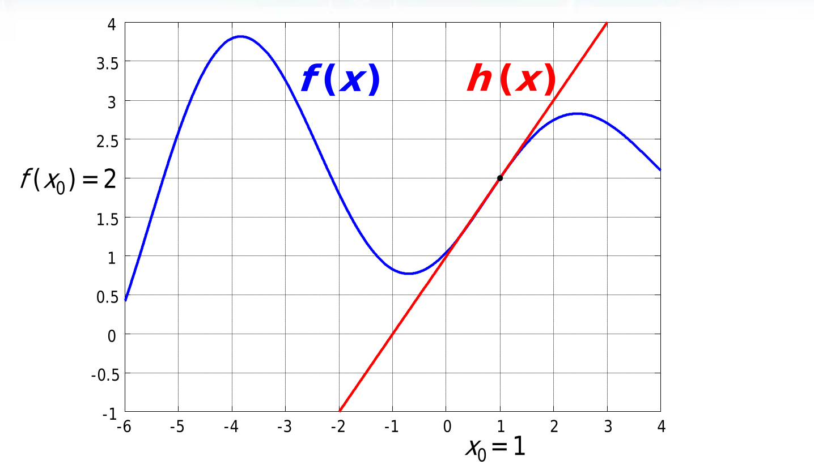

---  
dg-publish: true  
share: true  
---  
## Linearizzazione di una funzione reale  
Una funzione $f(x):\mathbb{R}\rightarrow\mathbb{R}$ può essere sviluppata in serie di Taylor in un intorno di ampiezza $\delta x=x-x_0$ di un punto qualsiasi $x_0$ come:  
$$f(x)=f(x_0+\delta x)=$$  
$$=\left.f(x_0)+\frac{df(x)}{dx}\right|_{x=x_0}\delta x$$  
che è lo sviluppo in serie di Taylor arrestato al termine di primo grado. La funzione che approssima è in tutto e per tutto una retta passante per $x_0$ con pendenza uguale alla derivata dell a funzione (quindi è la retta tangente al punto $x_0$). L'approssimazione è migliore tanto più è piccolo $\delta x$ ovviamente (tanto più $x$ è effettivamente vicino a $x_0$).  
  
  
## Linearizzazione di un sistema dinamico  
I sistemi dinamici reali *non sono mai lineari*, ma possono essere approssimati nell'intorno di punti specifici (es. l'equilibrio) mediante **linearizzazione**. Ci interessa farlo perchè le tecniche per il controllo automatico di un sistema lineare funziona è ormai ben consolidata mentre quella dei sistemi non lineari no.  
  
Esempio: un braccio robotico che deve fare una saldatura: quando si muove di tanto, non lo riesco a prevedere facilmente, ma ci riesco in intorni di punti. Se il braccio robotico non è esattamente dove dovrebbe saldare, ma lì vicino, posso linearizzare il sistema del braccio per ottenere previsione e controllo sul movimento del braccio abbastanza fedeli, sebbene si tratti di un'approssimazione.  
  
Dato un sistema dinamico a dimensione finita MIMO TC non lineare **stazionario** (le espressioni di variabili di stato e uscita non dipendono esplicitamente da $t$), si identificano dei "punti di funzionamento, o movimenti, *nominali*" che sono semplicemente punti di funzionamento, o movimenti, di interesse per il progettista. Quindi si prendono in considerazione:  
- un movimento *nominale* $\tilde{x}(t)$, che è quello che si vorrebbe analizzare e determinare (es. il movimento che il braccio robotico fa per fare la saldatura), ottenuto applicando un ingresso *nominale* $\tilde{u}(t)$ al sistema, posto in uno stato iniziale *nominale* $\tilde{x}_0$, a cui corrisponde un'uscita $\tilde{y}(t)$ *nominale*; essi devono essere ammissibili, quindi devono soddisfare le equazioni di stato e di uscita del sistema preso in considerazione:  
  $$\dot{\tilde{x}}(t)=f(\tilde{x}(t),\tilde{u}(t))$$  
  $$\tilde{y}(t)=g(\tilde{x}(t),\tilde{u}(t))$$  
  $$\tilde{x}(0)=\tilde{x}_0$$  
    
- un movimento *perturbato* $x(t)$ ottenuto applicando un ingresso differente (*perturbato*) al sistema, posto in uno stato iniziale differente (*perturbato*), a cui corrisponde un'uscita *perturbata*.   
  
Quindi si sta cercando di approssimare un sistema con un modello che lo approssimi bene intorno ad un suo punto, magari di equilibrio ma non per forza, semplicemente che sia di interesse; qui il $\delta x$ di Taylor sarebbe la "distanza" tra il sistema nominale e il sistema perturbato, ovvero la loro differenza *parametrica* in termini di:  
- stato: $\delta x(t)=x(t)-\tilde{x}(t)=$ *perturbazione sullo stato*, $\in \mathbb{R}^n$  
- ingresso: $\delta u(t)=u(t)-\tilde{u}(t)=$ *perturbazione sull'ingresso*, $\in \mathbb{R}^p$  
- uscita: $\delta y(t)=y(t)-\tilde{y}(t)=$ *perturbazione sull'uscita*, $\in \mathbb{R}^q$  
### Calcolo delle perturbazioni del sistema  
Le perturbazioni   
$$\delta{x}=x-\tilde{x}$$  
$$\delta{u}=u-\tilde{u}$$  
$$\delta{y}=y-\tilde{y}$$  
sono determinabili tramite le equazioni differenziali del sistema stesso, di cui esse devono per forza essere soluzioni:  
$$\dot{x}(t)=f(x(t),u(t))\implies\dot{(\delta x)}(t)=f(\delta x(t),\delta u(t))$$  
$$\dot{y}(t)=g(x(t),u(t))\implies\dot{(\delta y)}(t)=g(\delta x(t),\delta u(t))$$  
È anche vero che:  
$$\dot{(\delta x)}(t)=\frac{d(x-\tilde{x})(t)}{dt}=\dot{x}-\dot{\tilde{x}}$$  
$$\dot{(\delta y)}(t)=\frac{d(y-\tilde{y})(t)}{dt}=\dot{y}-\dot{\tilde{y}}$$  
E che:  
$$\dot{\tilde{x}}(t)=f(\tilde{x}(t),\tilde{u}(t))$$  
$$\tilde{y}(t)=g(\tilde{x}(t),\tilde{u}(t))$$  
Quindi:  
$$\dot{(\delta x)}(t)=f(x(t),u(t))-f(\tilde{x}(t),\tilde{u}(t))$$  
$$\dot{(\delta y)}(t)=g(x(t),u(t))-g(\tilde{x}(t),\tilde{u}(t))$$  
A questo punto posso sviluppare $f(x(t),u(t))$ e $g(x(t),u(t))$ in serie di Taylor in un intorno di $\tilde{x}(t)$ $\tilde{u}(t)$, come:  
$$f(x(t),u(t))=f(\tilde{x}(t)+\delta x(t),\tilde{u}(t)+\delta u(t))$$  
dallo sviluppo in serie di Taylor di funzioni in due variabili reali, arrestato al primo ordine:  
$$f(x(t),u(t))\approx$$  
$$\approx f(\tilde{x}(t),\tilde{u}(t))+\frac{\partial f(x,u)}{\partial x}\Bigg\rvert_{\substack{x=\tilde{x}\\u=\tilde{u}}}\delta x(t)+\frac{\partial f(x,u)}{\partial u}\Bigg\rvert_{\substack{x=\tilde{x}\\u=\tilde{u}}}\delta u(t)$$  
Riportando questo risultato nell'equazione di sopra:  
$$\dot{(\delta x)}(t)\approx f(\tilde{x}(t),\tilde{u}(t))+\frac{\partial f(x,u)}{\partial x}\Bigg\rvert_{\substack{x=\tilde{x}\\u=\tilde{u}}}\delta x(t)+\frac{\partial f(x,u)}{\partial u}\Bigg\rvert_{\substack{x=\tilde{x}\\u=\tilde{u}}}\delta u(t)-f(\tilde{x}(t),\tilde{u}(t))$$  
$$\dot{(\delta x)}(t)\approx\frac{\partial f(x,u)}{\partial x}\Bigg\rvert_{\substack{x=\tilde{x}\\u=\tilde{u}}}\delta x(t)+\frac{\partial f(x,u)}{\partial u}\Bigg\rvert_{\substack{x=\tilde{x}\\u=\tilde{u}}}\delta u(t)$$  
Analogamente,  
$$\dot{(\delta y)}(t)\approx\frac{\partial g(x,u)}{\partial x}\Bigg\rvert_{\substack{x=\tilde{x}\\u=\tilde{u}}}\delta x(t)+\frac{\partial g(x,u)}{\partial u}\Bigg\rvert_{\substack{x=\tilde{x}\\u=\tilde{u}}}\delta u(t)$$  
Per terminare e scrivere meglio ste robe, noi sappiamo che quelle derivate parziali di funzioni in due variabili sono **matrici Jacobiane**:  
$$A(t)=\frac{\partial f(x,u)}{\partial x}\Bigg\rvert_{\substack{x=\tilde{x}\\u=\tilde{u}}}=\left.\begin{bmatrix}   \partial f_1/\partial x_1 & \dots & \partial f_1/\partial x_n\\   \vdots & \ddots & \vdots   \\   \partial f_n/\partial x_1 & \dots & \partial f_n/\partial x_n   \end{bmatrix}\right\rvert_{\substack{x=\tilde{x}\\u=\tilde{u}}}\in\mathbb{R}^{n\times n}$$  
>^^ Jacobiano di $f$ rispetto ad $x$: in ogni riga c'è il gradiente di $f_i$ rispetto ad $x$  
  
Poi è anche $$B(t)=\left.\begin{bmatrix}   \partial f_1/\partial u_1 & \dots & \partial f_1/\partial u_n\\   \vdots & \ddots & \vdots   \\   \partial f_n/\partial u_1 & \dots & \partial f_n/\partial u_n   \end{bmatrix}\right\rvert_{\substack{x=\tilde{x}\\u=\tilde{u}}}\in\mathbb{R}^{n\times n}$$  
E si può dire   
$$\dot{(\delta{x})}\approx A(t)\delta x(t)+B(t)\delta u(t)$$  
>^^ In generale, $A(t)$ e $B(t)$ sono infatti dipendenti dal tempo.   
  
Analogamente,   
$$\delta{y}\approx C(t)\delta x(t)+D(t)\delta u(t)$$  
con $C(t)$ e $D(t)$ anche loro Jacobiani di $g$, rispetto ad $x$ e ad $u$.  
  
## Conclusione  
Il sistema dinamico linearizzato, nostra astrazione che non esiste ma ci semplifica i calcoli, perchè è praticamente la stessa cosa fare i calcoli su questo rispetto a farli su quello non lineare di partenza, è quindi espresso dalle equazioni:  
$$x=\tilde{x}+\delta x$$  
$$u=\tilde{u}+\delta u$$  
$$y=\tilde{y}+\delta y$$  
dove i $\delta$ sono dati da  
$$\dot{(\delta{x})}\approx A(t)\delta x+B(t)\delta u(t)$$  
$$\delta x(0)=x(0)-\tilde{x}(0)$$  
$$\delta{y}\approx C(t)\delta x(t)+D(t)\delta u(t)$$  
$$A(t)=\left.\begin{bmatrix}   \partial f_1/\partial x_1 & \dots & \partial f_1/\partial x_n\\   \vdots & \ddots & \vdots   \\   \partial f_n/\partial x_1 & \dots & \partial f_n/\partial x_n   \end{bmatrix}\right\rvert_{\substack{x=\tilde{x}\\u=\tilde{u}}}$$  
$$B(t)=\left.\begin{bmatrix}   \partial f_1/\partial u_1 & \dots & \partial f_1/\partial u_n\\   \vdots & \ddots & \vdots   \\   \partial f_n/\partial u_1 & \dots & \partial f_n/\partial u_n   \end{bmatrix}\right\rvert_{\substack{x=\tilde{x}\\u=\tilde{u}}}$$  
$$C(t)=\left.\begin{bmatrix}   \partial g_1/\partial x_1 & \dots & \partial g_1/\partial x_n\\   \vdots & \ddots & \vdots   \\   \partial g_n/\partial x_1 & \dots & \partial g_n/\partial x_n   \end{bmatrix}\right\rvert_{\substack{x=\tilde{x}\\u=\tilde{u}}}$$  
$$D(t)=\left.\begin{bmatrix}   \partial g_1/\partial u_1 & \dots & \partial g_1/\partial u_n\\   \vdots & \ddots & \vdots   \\   \partial g_n/\partial u_1 & \dots & \partial g_n/\partial u_n   \end{bmatrix}\right\rvert_{\substack{x=\tilde{x}\\u=\tilde{u}}}$$  
**Questa approssimazione vale sempre a patto che le perturbazioni $\delta$ siano piccole**.  
## Tempo discreto  
Anche il sistema a tempo discreto non lineare si può linearizzare:  
  
  
## Linearizzazione nell'intorno dell'equilibrio  
Se il movimento nominale che scegliamo è un movimento costante, dato da un punto di equilibrio, succede che **le matrici Jacobiane non dipendono più dal tempo**: quindi diventano $A,B,C,D$ costanti ed è chiaro che il sistema linearizzato a questo punto sia **un sistema LTI**.  
  
  
  
