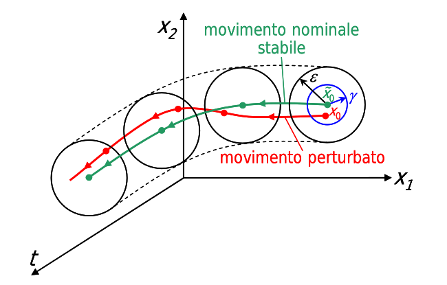
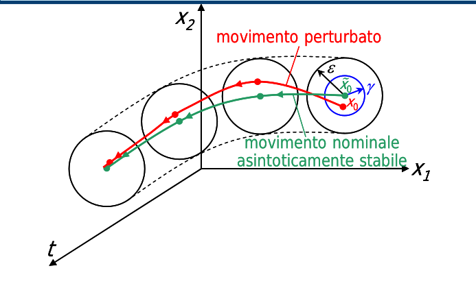
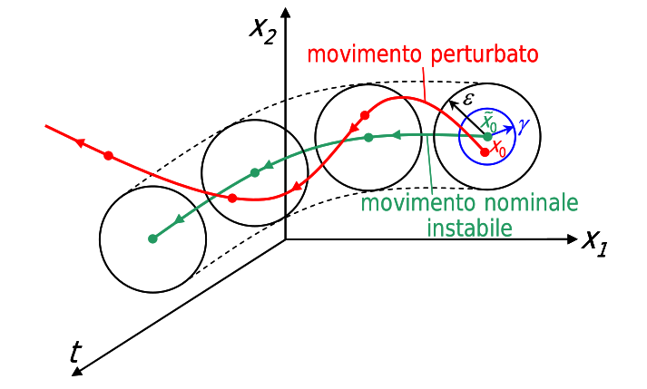
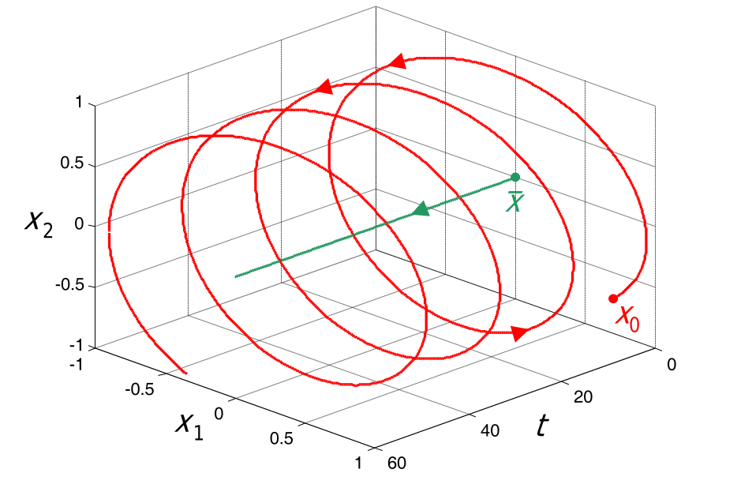
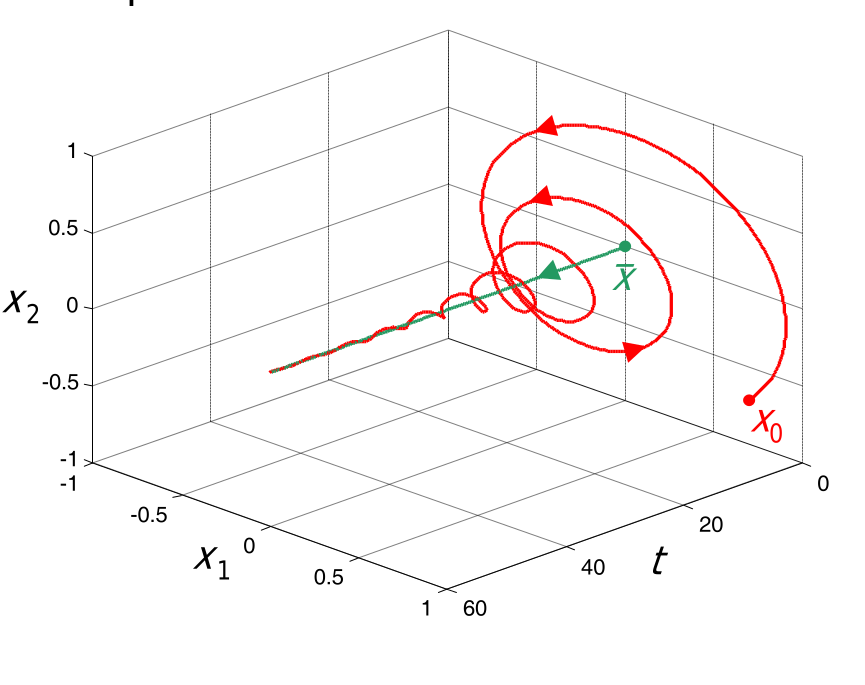
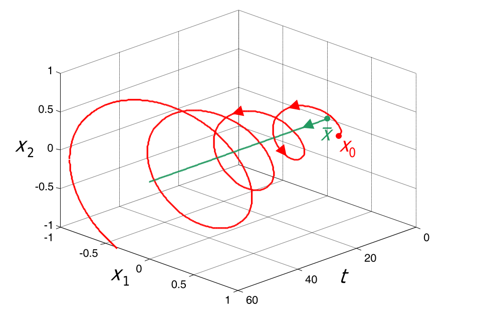

---  
dg-publish: true  
share: true  
tags:  
  - controllare  
---  
In termini pratici, un sistema è **stabile** se variazioni piccole di stato iniziale, ingressi, parametri non da luogo se non a piccole variazioni nella sua successiva evoluzione.  
Un sistema *esternamente stabile* è detto tale se variazioni *degli ingressi* non portano la risposta a divergere ad infinito.  
Un sistema *internamente stabile* è detto tale se variazioni *dello stato iniziale* non portano la risposta a divergere ad infinito (quindi non è che se parto in uno stato già alterato se ne va a fanculo l'uscita).  
  
## Stabilità interna di sistemi dinamici TC  
Dati:  
- un movimento *nominale* del sistema $\tilde{x}(t)$ ottenuto applicando un ingresso nominale $\tilde{u}(t)$ posto in uno stato iniziale nominale $\tilde{x}_0$  
- un movimento *perturbato* del sistema $x(t)$ ottenuto applicando *lo stesso ingresso nominale $\tilde{u}(t)$*, ma con la differenza che il sistema *è si sarà mosso da uno stato iniziale diverso, perturbato, $x_0$*  
**si valuta lo scarto** $x(t)-\tilde{x}(t)=\delta x(t)$ (in particolare la sua norma euclidea o infinito):  
- se rimane sempre limitato nel tempo, il movimento $\tilde{x}(t)$ è detto **stabile**, ma *mai dire stabile e basta per caratterizzare un movimento*  
	- se la perturbazione, oltre a restare sempre limitata nel tempo, tende anche ad annullarsi spontaneamente (es. oscillazioni di un pendolo), il movimento è detto **asintoticamente stabile**  
		- se la perturbazione tende a zero *qualunque sia la perturbazione iniziale* (cioè praticamente da dove parto parto, se non cambiano ingressi e parametri, finisco sempre nello stesso punto finale), il movimento è detto **globalmente asintoticamente stabile**  
	- se la perturbazione resta sempre limitata nel tempo ma non tende ad annullarsi spontaneamente (es. oscillazioni di un pendolo *senza attriti*), il movimento è detto **semplicemente stabile**  
- se non rimane sempre limitato nel tempo (anzi, se diverge all'infinito), il movimento è detto **instabile**.  
  
  
  
### Definizione tramite limite di Lyapunov  
Ricordando la definizione di continuità di una funzione (a valore reale e di variabile reale $x$) nell'intorno di un punto $x_0$: la funzione $f(x)$ è detta continua nell'intorno di $x_0$ se, per ogni $\epsilon > 0$, esiste un $\gamma > 0$ tale che:  
$$\forall x\in \mathbb{R}: |x-x_0| < \gamma({\epsilon})\implies |f(x)-f(x_0)|\le\epsilon$$  
ovvero vale il limite: $\lim_{x\rightarrow x_0}f(x)=f(x_0)$.  
In modo analogo Lyapunov definì la stabilità del movimento in questo modo:  
$$\forall t\in [0, +\infty): ||x_0-\tilde{x_0}|| \le \gamma\implies |x(t)-\tilde{x}(t)|\le\epsilon$$  
Nell'immagine vedi uno che si può definire *semplicemente stabile*, comunque essendo stabile rispetta la proprietà di cui sopra:  
  
  
  
Un movimento *asintoticamente stabile*, oltre a soddisfare questa proprietà, soddisfa anche   
$$\lim_{t\rightarrow +\infty} ||x(t)-\tilde{x}(t)||=0 $$ (cioè si muove ma alla fine converge nello stesso punto come se non ci fosse stata nessuna perturbazione)  
  
  
  
Per un movimento *globalmente asintoticamente stabile* valgono le due di cui sopra, ma la seconda vale anche $\forall x_0$.  
  
  
Movimenti *instabili* si definiscono per esclusione.  
  
  
  
## Sistemi a TD  
Non cambia nulla, l'equazione di stato è un'equazione alle differenze e uso la $k$ discreta invece della $t$ continua, ma comunque considero i movimenti nominali e quelli perturbati ecc. come prima, quindi non cambia proprio nulla.  
## Stabilità locale dell'equilibrio  
Si parla di stabilità dell'equilibrio nel caso in cui il movimento nominale considerato sia uno *stato di equilibrio*; l'aggettivo "stabile" allora si riferisce *allo stato di equilibrio* e non più al movimento stesso del sistema.   
  
Prima in sostanza avevamo che il movimento "nominale" considerato non era niente di che, solo un movimento qualsiasi che sapevamo non divergere. Rispetto a quello, che non abbiamo mai caratterizzano ma rimane un movimento generale qualunque del sistema, si faceva il confronto con un movimento del sistema ottenuto partendo da uno stato iniziale diverso e tenendo tutto il resto uguale.  
In quei casi, si otteneva (credo) la caratterizzazione della stabiità del sistema *in termini globali*, infatti l'aggettivo si dava "al movimento". #controllare  
  
Qui invece diciamo che il movimento nominale considerato è uno stato di equilibrio, il che ci dice che stiamo valutando **una stabilità locale**.  
Anche un sistema che non è di per sè internamente stabile e può divergere *può avere degli stati di equilibrio*, partendo dai quali la risposta non diverge. Il nostro interesse non è capire se partendo da quello stato di equilibrio si diverga (quello siamo sicuri di no, perchè uno stato di equilibrio per definizione ha un'uscita di equilibrio finita) ma *cosa succede spostandoci un pochino da lì*. #controllare   
  
- Uno *stato di equilibrio stabile* fa sì che partendo da un punto contenuto in un intorno di quello stato di equilibrio non abbia mai una risposta divergente  
  
	  
- *Ad ogni stato di equilibrio asintoticamente stabile* è associata una **regione di attrazione** (o regione di *asintotica stabilità*), costituita da quegli stati iniziali che danno origine a movimenti perturbati *convergenti asintoticamente allo stato d’equilibrio* - cioè se parto da un punto lì vicino, finisco nella stessa uscita come se fossi partito proprio dallo stato iniziale di equilibrio  
	-   
- Un sistema dinamico che ammette uno stato di equilibrio globalmente asintoticamente stabile **non potrà avere nessun altro stato di equilibrio** - quindi o uno solo, che sia globalmente asintoticamente stabile, oppure uno o più, ma nessuno di questi sarà globalmente asintoticamente stabile  
	- non avrebbe senso averne due, perchè dato che ad un certo punto di equilibrio corrisponde anche una sua uscita di equilibrio, se esistessero due stati di equilibrio asintoticamente stabili non potrei finire "da tutti i punti di partenza, sempre in quel punto" perchè potrei partire da quell'altro stato di equilibrio e finire da quell'altra parte.  
  
Esempio di stato di equilibrio instabile:  
  
