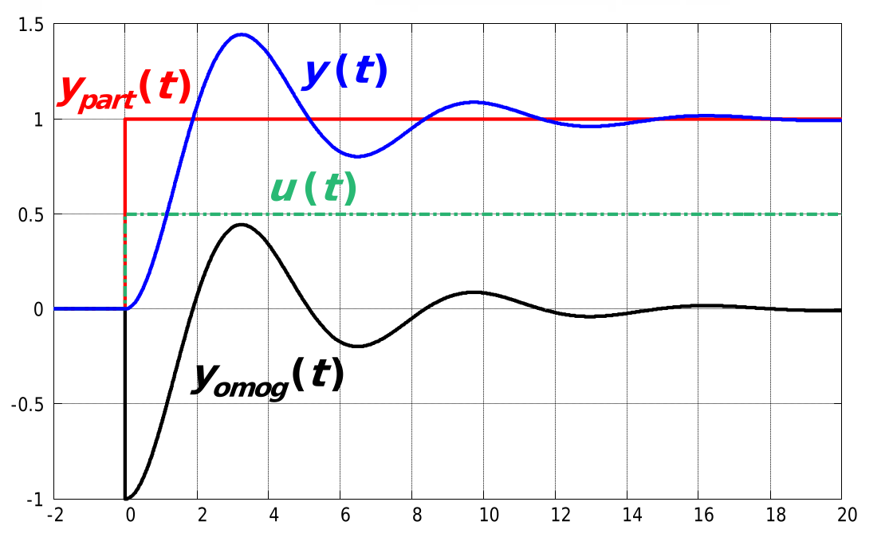
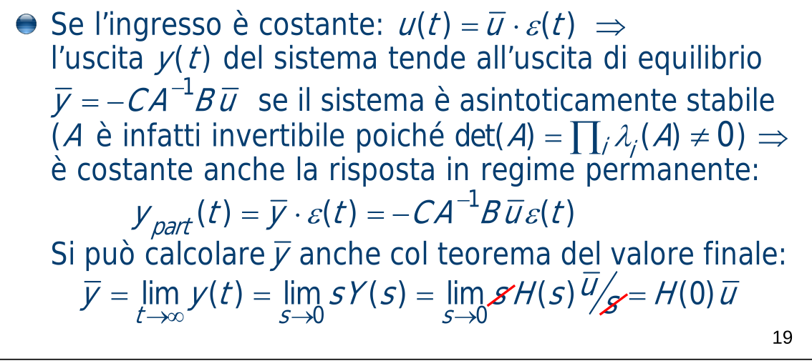
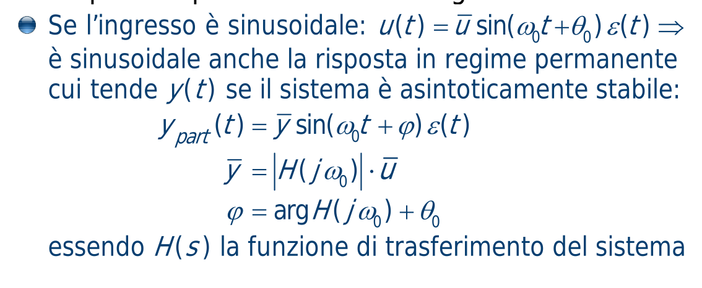

---  
share: true  
tags:  
  - todo  
---  
Un sistema dinamico LTI inizialmente a riposo harisposta libera nulla, quindi la sua risposta complessiva è data dalla sola risposta forzata. Si può quindi scrivere   
$$Y(s)=H(s)U(s)$$  
Partendo da questa si può dire che il sistema è detto **BIBO-stabile** (*bounded input - bounded output*) o **esternamente stabile** se la sua risposta forzata *a ingressi limitati* è sempre limitata.  
  
> [!Info]  
> **Forma minima**  
> Un sistema può essere rappresentato in mille modi, ma quando un sistema è rappresentato in una forma tale che sia completamente raggiungibile e completamente osservabile è detto **in forma minima**. Un sistema in forma minima contiene il numero minimo di variabili di stato per descriversi.  
> Scrivendo la funzione di trasferimento del sistema nella forma $H(s)=\frac{N(s)}{D(s)}$ tramite $H(s)=C(sI-A)^{-1}B+D$ avrai che le radici del denominatore, dette *poli* del sistema, sono in generale un *sottoinsieme* degli autovalori di $A$. Questo perchè potrebbero avvenire delle cancellazioni zeri-poli e quindi arriveresti ad avere una funzione di trasferimento con un numero di poli minore del numero degli autovalori.  
>   
> Se il sistema è in forma minima, però, i poli coincidono esattamente con gli autovalori.  
  
La condizione per la stabilità esterna è praticamente la stessa della stabilità interna, **ma applicata solo ai poli**.  
Il sistema è BIBO-stabile se tutti i poli della funzione di trasferimento hanno parte reale strettamente negativa (nel caso TC) oppure modulo strettamente minore di 1 (nel caso TD).  
  
Ci sono quindi delle implicazioni che legano i due tipi di stabilità:  
- sistema (internamente) asintoticamente stabile $\implies$ tutti i suoi poli sono nella regione di asintotica stabilità $\implies$ sistema esternamente stabile   
	- sistema esternamente stabile e in forma minima $\implies$ tutti i suoi poli sono nella regione di asintotica stabilità e in più i poli coincidono precisamente con gli autovalori di $A$. Quindi, paradossalmente, puoi dire che per analizzare il sistema puoi analizzare il $D(s)$ invece che il polinomio caratteristico $p(\lambda)$ di $A$.  
   
Queste implicazioni ci semplificano di parecchio il lavoro di verifica della stabilità:  
- se ci viene detto che il sistema è asintoticamente stabile, è automaticamente anche esternamente stabile  
- se ci viene detto che il sistema è in forma minima e ci viene data la FdT, per verificare la stabilità interna ci basta scomporre il $D(s)$ (o se non vogliamo scomporlo, possiamo usare i criteri di Cartesio, Routh o Jury) e verificare la solita condizione: così otterremo sia l'informazione sulla stabilità interna che sulla stabilità esterna  
- se ci viene detto che il sistema è in forma minima e ci vengono date le matrici, per verificare la stabilità interna possiamo calcolare la $H(s)$ e verificare la solita condizione sui poli invece che cercare di calcolare gli autovalori. Ma questo è idiota come processo perchè è molto più veloce calcolare il polinomio caratteristico e al massimo usare Routh/Jury, al posto di fare $C(sI-A)^{-1}B+D$ e poi rischiare di dover usare comunque Routh/Jury perchè il denominatore non si scompone facilmente o ha parametri variabili  
- #todo forse ci sta anche qualche semplificazione se il sistema ci viene dato in forma matriciale e canonica di raggiungibilità / controllabilità, ma non ne sono sicuro.  
  
## Risposta in regime permanente  
  
  
  
Dall'analisi modale si scopre che la $y_\text{omogenea}$, ovvero la risposta libera, è *combinazione lineare dei modi del sistema*.   
  
Un sistema asintoticamente stabile tende, all'infinito, ad avere parti reali degli autovalori della matrice di stato nulli, e quindi una risposta libera nulla; per cui per tempi sufficientemente grandi è vero $y(t)=0+y_{\text{particolare}}(t)=y_{\text{forzata}}(t)$.  
La risposta di un sistema dinamico asintoticamente stabile (o esternamente stabile e in forma minima) può allora essere divisa in un **transitorio iniziale** e in una **risposta in regime permanente**.   
  
In pratica, il sistema non influenza la *forma* della risposta (le frequenze contenute nel segnale), ma le trasformazioni che applica all'ingresso sono solo in modulo (intensità del segnale) e in fase (ritardo / anticipo del segnale).  
  
Per un ingresso di tipo gradino (quindi costante) anche la risposta in regime permanente sarà costante, al massimo scalata.   
  
  
  
Se l'ingresso è sinusoidale, anche la risposta in regime permanente sarà sinusoidale, al massimo scalata e sfasata.  
  
  
